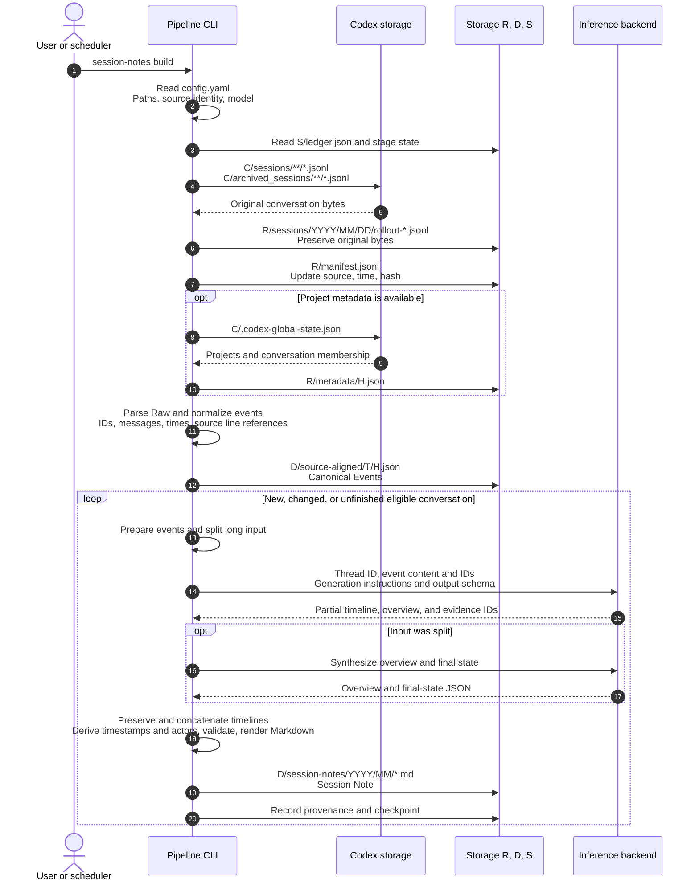

# Tkn Codex Chat Note Pipeline

Japanese: [README_ja.md](README_ja.md)

Preserve local Codex conversations as source evidence and turn each conversation into
a reusable Session Note. Notes retain requests, corrections, failed attempts,
unresolved questions, a source-backed timeline, and the last known state.
They support later reconsideration from different viewpoints.

A **session** means one continuous sequence of conversation, listed chronologically
in one Markdown note.

Processing ends at Session Notes. Classification and Working Context belong to
[tkn_genai_context_curation_pipeline](https://github.com/tuckn/tkn_genai_context_curation_pipeline);
Decision distillation belongs to
[tkn_genai_insight_pipeline](https://github.com/tuckn/tkn_genai_insight_pipeline).
Each CLI installs independently and exchanges versioned files.

## Usage: get the first result

### Requirements and installation

Python 3.11+, uv, readable local Codex JSONL logs, and a configured inference
provider for generation. Codex CLI is the default; Claude Code, GitHub Copilot
CLI, and local Ollama are inference alternatives. **Chat acquisition is Codex-only.** Inference provider selection is independent.
Other applications' chat acquisition is outside this repository's scope.

~~~console
cd "C:\path\to\tkn_codex_chat_note_pipeline"
uv tool install .
tkn-codex-chat-note --help
tkn-codex-chat-note config init
~~~

Edit the displayed `~/.tkn/codex_chat_note_pipeline/config.yaml`. Select storage
roots and an available model. For Codex inference, check `codex --version` and
`codex login status` in the terminal; the desktop app does not replace the CLI.
See the packaged [configuration example](src/tkn_codex_chat_note/resources/config.example.yaml).

### First capture and generation

~~~console
tkn-codex-chat-note config show
tkn-codex-chat-note clone --dry-run
tkn-codex-chat-note clone
~~~

`clone` initializes missing owned storage, captures all locally available
history, normalizes supported events, and generates eligible Session Notes.
It writes by default and may use substantial inference time/tokens.
`--dry-run` reads local inputs and validates the plan; it makes no inference or
network calls and creates no directories, locks, caches, or reports.

### Daily updates and results

~~~console
tkn-codex-chat-note pull
tkn-codex-chat-note status
tkn-codex-chat-note provenance validate
~~~

`pull` captures changed or newly discovered logs, updates eligible notes, and
resumes unfinished work. Repeating a successful unchanged run makes no model
calls. The default idle interval is 30 minutes; Raw capture still precedes
deferral of active conversations. `--limit 20` bounds note generation attempts.

Press `Ctrl+C` to interrupt `clone` or `pull`. Saved Raw files and completed
notes remain; the next `pull` skips successfully generated notes whose inputs,
generation settings, and note content are unchanged. Validated chunks and merges
are checkpointed in the cache. With identical inputs and generation settings,
a retry reuses saved stages and repeats the unfinished stage. Changed inputs,
models, prompts, or chunk settings and `--force` bypass stage reuse. Corrupt
checkpoints are regenerated. Deleting the cache removes this resume capability.
Interruption may display `KeyboardInterrupt` and leave the run report unfinished.

Open the note and report paths shown in the result. `status` reads the last-run
record, not live source state. Completion now depends only on eligible Session
Notes; no Scope, Decision, or Working Context build is required.

### Generation cost and comparison baselines

When completion and result records have the same invocation ID, turn and history,
identical command output is represented once with an original event reference.
All event IDs, completion metadata, Raw and Canonical Events remain available;
actual retries and different output are retained. The model selects one timeline
anchor event; code derives its time, actor and both public endpoints. Content and
source validation still apply.

Each report thread exposes `generationMetrics`: input characters removed, chunks,
model calls, repairs, checkpoint reuse and elapsed time. `submittedPromptCharacters`
counts prompt characters across repairs and transport attempts; it excludes schema
or other material added by the provider and is not a billing token count.

Version 0.17.0 changes generation conditions: unreviewed notes made with older
conditions become regeneration candidates on the next normal run. Before installing
and running, preserve comparison notes, source snapshots from provenance, hashes
and generation settings in a separate evaluation area. Current Raw paths may change.
Compare the same source version and judge against the original evidence rather than
treating the previous note as ground truth. Reviewed/edited-note protections remain.

### Weekly updates with Windows Task Scheduler

After the initial `clone`, register a weekly `pull` using the same Windows user
that normally signs in to the inference CLI. Set the program to the absolute
path of the installed `tkn-codex-chat-note.exe` and the arguments to
`--config "C:\path\to\config.yaml" pull`. Config options precede `pull`.
A `.tkn/config.yaml` in the starting directory joins the configuration layers;
use a starting directory consistent with your normal resolved configuration.
Enabled WSL sources must be readable through their configured UNC paths by that user.

Unfinished notes resume on the next `pull`. A limited verification run or a run
with notes deferred by activity or the runtime limit returns exit code `2`.
For exit code `1`, inspect the failure reasons in the report. `runtime_minutes`
is the deadline for starting generation; in-flight generation has up to nine
additional minutes. Raw capture and normalization are not interrupted by this
generation deadline. Allow sufficient time before Task Scheduler stops the process.

## Commands

Global options, including `--config` and inference options, precede the command.

| Command | Behavior |
| --- | --- |
| `config init` | Create packaged user configuration; preserve edits; `--force` backs up before replacement |
| `config show` | Read resolved values, five configuration layers, and summary profile hashes |
| `clone` | Initialize and capture/build available history; resumable |
| `pull` | Update an initialized store and resume notes |
| `raw ingest` | Capture source bytes without inference |
| `session-notes build` | Refresh notes; `--thread-id` selects one conversation |
| `session-notes validate <artifact>` | Read-only note validation |
| `status` | Read the previous run's coverage and report path |
| `provenance validate` | Read-only hash, identity, and relationship checks |
| `storage migrate` | Copy a source store into fresh roots using `--from-config`; inspect with `--dry-run` |

Build commands support `--dry-run`, `--force`, `--allow-edited`, and
`--full-output`. `--force` re-evaluates unchanged input but does not unlock
reviewed files. `--allow-edited` explicitly permits replacing manually edited,
unreviewed notes. Raw ingest supports `--dry-run` and `--full-output`.

Progress uses stderr; stdout is JSON. `-q` suppresses progress, `-v` adds
diagnostics. Exit codes: `0` successful command/plan, `1` failure, `2` incomplete
clone/pull (for example deferred or protected work). A leaf build's report
describes overall note coverage even when one thread was selected.

## Configuration

Precedence: built-in → user-global → current directory `.tkn/config.yaml` →
explicit `--config` → CLI options. Each supplied layer is validated before
merging. Relative paths resolve against the file declaring them. Schema 7.0.0
uses snake_case keys and quoted SemVer; unknown keys and newer unsupported
versions fail visibly.

~~~console
tkn-codex-chat-note --config "C:\path\to\config.yaml" clone
tkn-codex-chat-note --idle-minutes 0 --runtime-minutes 60 pull --limit 20
~~~

### Storage directories

By default, data is stored under `~/.tkn/codex_chat_note_pipeline/<kind>/codex/<source_id>`.
To change the storage directories, set `raw_root`, `data_root`, and `state_root` under each `sources.<source_id>` entry in `config.yaml`.
`cache_root` is shared and cannot be configured separately for each `sources.<source_id>` entry.

```yaml
schema_version: "7.2.0"
cache_root: ~/.cache/codex_chat_note_pipeline
sources:
  my-windows-pc:
    enabled: true
    source_root: ~/.codex
    include_archived: true
    raw_root: C:/path/to/my-chat-store/raw
    data_root: C:/path/to/my-chat-store/data
    state_root: C:/path/to/my-chat-store/state
  my-wsl-ubuntu:
    enabled: false
    source_root: '//wsl$/Ubuntu/home/<user>/.codex'
    include_archived: true
```

Keep all actual roots separate from one another, source roots, and configuration.
A common parent such as `my-chat-store/` can group `raw/`, `data/`, and `state/`
for backup and relocation. Treat state as durable restart/checkpoint data and
retain it with data; provenance under data contains the published evidence.
Cache is disposable and is not copied by migration. Missing app metadata does
not prevent conversation capture.

Inference transport configuration and authentication details are retained in
[inference providers](#inference-configuration). Generation through an
external CLI may send selected inputs to its service; Ollama is restricted to
a loopback endpoint. Model availability and authentication are provider-owned.

### Session Note language

Set `generation.session_note_profile` in your existing `config.yaml` to `default-jp` (Japanese, the default) or `default-en` (English). The following is a configuration fragment; retain your other settings.

```yaml
generation:
  session_note_profile: default-en
```

For a single run, use `tkn-codex-chat-note --session-note-profile default-en pull`. The option precedes the command. `config show` reports the selected profile, its resources and hashes, and the configuration source.

Both built-in profiles preserve the same schema, headings, timeline, citations, and state rules. Only narrative language and explanatory notices change; times remain in Asia/Tokyo. Custom profile names, directories, and prompts are not supported. Bundles are packaged under `profiles/default-jp/` and `profiles/default-en/`.

Changing language makes an existing note eligible for regeneration on the next build/pull. Each conversation retains one note and its identity; this does not create parallel language editions. Reviewed or edited notes retain their existing protection, and dry-run never generates or writes. Interrupted work from a different profile is not reused.

### Chat sources and generation AI

`sources` configures local Codex conversation directories; `generation.providers`
configures the AI used to generate notes. `--provider` changes only
`generation.active_provider`, independently of acquisition. Claude Code, Copilot
and Ollama remain inference options; their chat acquisition is outside this CLI.

Each top-level `sources` key is a stable `source_id`. Do not repeat `source_id`
inside entries. Each source has `enabled` (default `true`), `source_root` (default
`~/.codex`), `include_archived` (default `true`), and optional final `raw_root`,
`data_root`, and `state_root`. `source_root` is the parent `.codex` directory,
not `sessions/`; it supplies sessions, archives, and app metadata. It does not
change Codex's own storage configuration, authentication, or inference provider.

Choose an ID for a persistent input directory: for example `laptop-windows` or
`laptop-wsl-ubuntu`. Lowercase ASCII **kebab-case** is recommended; an ID is a
configuration key, directory component, and provenance identifier, not a Python
variable. The exact rules are:

- ASCII letters (`A-Z`, `a-z`), digits, `.`, `_`, and `-`; start with a letter or digit.
- No spaces, Japanese/full-width characters, leading/trailing whitespace, or trailing dot.
- Windows device names such as `CON`, `nul.txt`, and `COM1` are rejected.
- IDs must be unique ignoring case across the sources map. Exact spelling is retained;
  IDs are never trimmed or automatically lowercased. Quote numeric-only YAML keys.

Published identity remains `(codex, source_id)` for compatibility with evidence and downstream readers.
Keep it stable after ingestion; changing the key does not rename or migrate an
existing store. Display-oriented folder names in `source_root` and output paths
can still contain spaces and Unicode. Register each input directory once.

Enabled Codex sources run sequentially in map order. `--limit` counts generation
attempts across the whole invocation (including failed attempts and dry-run plans),
and `runtime_minutes` provides one shared generation deadline. All selected stores
are checked before writes. Each source retains its own catalog, provenance,
checkpoint, and run report; a source processing failure is included in the overall
failure result while other sources can continue. `--full-output` includes per-source
thread details; ordinary output includes per-source totals and report paths.

~~~console
tkn-codex-chat-note clone --dry-run
tkn-codex-chat-note --source my-windows-pc pull
tkn-codex-chat-note --source my-windows-pc session-notes build --thread-id <thread-id>
tkn-codex-chat-note status
tkn-codex-chat-note provenance validate
~~~

`--source` precedes the command. It selects one enabled source for processing,
status, provenance validation, or storage migration; omitted selection means all
enabled sources for processing/status/provenance. `--thread-id` and storage migration
require one selected source when several are enabled. Unknown or disabled selections
fail visibly. `config show` always displays all configured sources and resolved roots.

Source maps merge by ID across config layers; later fields override only the same
source. An explicit map replaces the implicit built-in source, so adding your own
IDs never silently enables an extra `windows` source. `sources: {}` clears the
entire acquisition map; `enabled: false` disables one inherited source. Duplicate YAML keys
and case-only source IDs are rejected.

Disabled sources are not scanned and their input directories need not exist.
With no enabled source, processing stops before writes; `config show` remains
available. Retired `chat` and acquisition-provider wrappers are rejected.

Windows and WSL input directories need separate IDs. Windows can use the WSL UNC
path shown above when the distribution is accessible. When running this CLI inside
WSL, configure Linux paths and its generation executable; `~` follows the OS running
this CLI. The WSL example is a path configuration example, not a claim of completed
WSL integration testing. Account-based filtering is not implemented.

<a id="inference-configuration"></a>

### Inference providers

This CLI acquires locally stored Codex conversation logs.
You can change the generative AI model used for inference through
`generation.active_provider` and the selected provider's `model` setting.
Set the selected provider's model and transport; model
availability and authentication belong to the chosen service.

| Provider ID | Required transport setting | Execution |
| --- | --- | --- |
| `codex` | `executable: codex` | Standalone `codex exec` |
| `claude-code` | `executable: claude` | Non-interactive Claude Code |
| `github-copilot` | `executable: copilot` | Non-interactive Copilot CLI |
| `ollama` | `base_url: http://127.0.0.1:11434` | Local chat endpoint, loopback addresses only |

For example, replace the generation block to use an already available local model:

```yaml
generation:
  active_provider: ollama
  providers:
    ollama:
      model: <installed-local-model>
      reasoning_effort: high
      base_url: http://127.0.0.1:11434
```

CLI providers send the selected generation input through their configured
service. Raw captures and provenance snapshots retain source content locally;
choose storage appropriate for private conversation data. Generation profiles,
output validation, and retry limits are application-owned. Changing a model,
provider, reasoning setting, or generation profile invalidates affected stages.

### Rebuilding without retaining an existing store

Create a separate configuration, select empty `raw_root`, `data_root`, and
`state_root` directories, then follow "First capture and generation".
Rebuilding covers conversation logs still available in the source. The new
store does not inherit old note IDs, manual edits, or review status.

~~~console
tkn-codex-chat-note --config "C:\path\to\rebuild.yaml" config init
~~~

Edit the generated configuration and pass the same `--config` to subsequent
`config show` and `clone` commands. An explicit new configuration path also works
when default `config init` stops after detecting an old user configuration.
Any current user configuration or `.tkn/config.yaml` loaded by the CLI must
still use schema 7; `--config` does not bypass validation of lower layers.

## Azure API and bounded Ollama generation

Version 0.20.0 uses configuration schema 7.2.0. Azure CLI is not required.
Azure authentication follows the same SDK browser/persistent-cache approach as the
local audio transcriber: try cached credentials, open a browser only when interaction
is required, then retain the account record and encrypted token cache for later runs.
Sign-in can be required again after revocation or an organization policy change.
Browser access and a local callback connection are required for interactive sign-in.
Cancelling or timing out stops inference before submission; `pull` may already have
captured source history. Dry-run never authenticates or opens a browser.

The account record is stored below `~/.tkn/codex_chat_note_pipeline/authentication/`.
Access/refresh tokens remain in the SDK's encrypted cache, with no plaintext fallback.
Cache names are isolated by this application, endpoint and optional tenant. Other
applications' caches and Azure CLI accounts are not copied or modified. To select
another account, remove only this application's matching account record while no run
is active; the next generation requests browser account selection.

Minimal Azure configuration under `generation.providers` (select
`generation.active_provider: azure-openai`):

```yaml
azure-openai:
  model: <deployment-name>
  reasoning_effort: high
  azure:
    endpoint: https://<resource>.openai.azure.com/openai/v1/
```

`model` is the requested Azure deployment, not a separately maintained underlying
model name. Do not add `deployment`, `model_version`, or `subscription_id`.
`azure.tenant_id` is optional for environments requiring explicit tenant selection.
The API response supplies the actual model identity, including its revision when
returned; the CLI does not guess a revision. Notes use `generatorModel` for that
identity and `generatorDeployment` for the requested deployment. Provenance records
likewise separate `model` from `requestedDeployment`.

Prices are optional and keyed by deployment, so a `--model` override cannot silently
reuse another deployment's rates. Without matching rates, token estimates and usage
remain available, cost stays unknown, and the JPY cap is **not enforced**. Input/output
and call limits still apply. Add verified rates under `azure` when a cost cap is needed:

```yaml
pricing:
  <deployment-name>:
    input_jpy_per_million: 100.0  # Placeholder; replace with the applicable rate.
    output_jpy_per_million: 500.0
    pricing_date: YYYY-MM-DD
```

`limits` is optional. Defaults: input 60,000, output 16,000, context 100,000 tokens,
chunk size 120,000 characters, 30 calls and a JPY 100 reservation cap when priced.
These limits do not claim to describe every deployment's model capabilities. Rates
are user-maintained estimates, not Azure billing discovery; refresh them when the
model behind an unchanged deployment changes.

Legacy schema-7.0/7.1 Azure config is normalized in memory: `azure.deployment` becomes
`model`, the old model/version and subscription requirement are removed, and flat
prices move under that deployment. Files are not rewritten automatically. Explicitly
update the user config and use `config show` to inspect effective values.

The v1 Chat Completions request uses strict JSON, `store=false`, an explicit completion
limit including reasoning, and the deployment name. Each response must identify its
actual model. Cached stages retain that identity; if a later response or cached stage
has another identity, generation stops without combining models. Run `--force` to
regenerate after changing the model behind the same deployment. Fully cached/current
notes do not contact Azure, so they cannot detect server-side deployment updates.
Endpoint/deployment/config changes naturally select another generation identity.

Schema constraints unsupported by the API are omitted only from transport and still
checked locally. Refusals, incomplete output and 401/403 fail without blind retries.
429 and transient server/network failures allow at most three attempts; Retry-After
seconds/date and millisecond headers are honored. Delays over 60 seconds stop for a
later resume. Semantic repairs count toward budgets.

For Ollama, configure `limits` and a pinned `model_digest` under its provider entry.
`context_tokens` and `output_tokens` set `num_ctx` and `num_predict`. For example,
start an explicit experiment with input 48000, output 8192, context 65536; these are
experiment limits, not a hardware recommendation. The tokenizer-independent UTF-8
byte bound is deliberately conservative and can result in many small chunks.
Without `limits`, the older Ollama behavior is preserved.

Complete prompts and schemas are checked before sending chunks, merges, and
repairs. Azure estimates use a verified local `o200k_base` cache plus a margin, or
a conservative byte bound when unavailable; estimates are not billed tokens. Chunk size is
reduced automatically to fit. An oversized merge/repair stops with saved chunks
rather than silently dropping input; raise suitable limits or revise the reduction
strategy before resuming. Dry-run does not acquire credentials, authenticate, or call AI.

Budgets apply to one sequential provider runner/command, shared across selected sources. Each submitted attempt
reserves its estimated input plus maximum output cost; failed attempts with unknown
billing keep their reservation. Reservations are not refunds or invoice values.
A new command/process gets a new budget; concurrent processes do not share a global
cap. Azure budget alerts also do not stop spending. Use current applicable prices,
run one process, and account for earlier attempts when restarting an evaluation.

Run reports include `generationMetrics.apiRequests`: actual input/output/reasoning/
cached input tokens when returned, response model, elapsed time, and an estimated
JPY cost. Missing usage stays null. The estimate charges cached input at the normal
input rate (conservative); cache-write tokens are unknown unless reported. Connection,
deployment/settings, limits, and digest enter generation fingerprints and provenance.
Actual response models are tracked separately in requests and validated checkpoints.

To evaluate pinned Canonical Events without touching the live store, use
`scripts/evaluate_session_notes.py --manifest <private-baseline-manifest.json>
--config <generation-config.yaml> --output <fresh-evaluation-directory>
--thread <thread-id>`. `--dry-run` only validates the plan. The script verifies
snapshot hashes, saves validated Markdown/structured JSON and per-attempt metrics in
`run-history` (including earlier attempts after a resume),
and reuses completed outputs/checkpoints when the same conditions are repeated.
The output directory must be dedicated to that evaluation. A manifest row contains
`metadata`, the original provenance `activity`, and `files` mapping `sessionNote`,
`raw`, and `canonicalEvents` to copied SHA-256-named snapshot files.

Implementation references: [Azure structured outputs](https://learn.microsoft.com/en-us/azure/foundry/openai/how-to/structured-outputs),
[Browser credential](https://learn.microsoft.com/en-us/python/api/azure-identity/azure.identity.interactivebrowsercredential),
[Ollama chat API](https://docs.ollama.com/api/chat).

API requests use short, reversible source-ID aliases in structured input and a shared
JSON Schema enum for all citations. Responses are mapped back to the original IDs
before validation; source prose, Raw and Canonical Events are unchanged. This reduces
repeated identifier tokens and prevents abbreviated/invented citation IDs. Merge
repairs also receive the allowed IDs without resending raw events. `apiRequests`
records the wire encoding as `event-id-aliases-v1`.

### Preview size/cost and observe actual usage (0.19.0)

```console
tkn-codex-chat-note clone --dry-run
tkn-codex-chat-note pull --dry-run --limit 1
tkn-codex-chat-note pull --limit 1
```

Dry-run reports estimates for selected notes that need generation; current, reviewed,
edited/protected and deferred notes do not add inference cost. It reads validated chunk
checkpoints and excludes reusable chunks. A final merge reserves one call until its exact
input is known, even if a merge or staged note might later be reusable. Nothing is written,
no login occurs, and no network request is made. `--full-output` includes each thread's
`generationEstimate`; the compact JSON retains the aggregate estimate.

All providers show prepared input characters, pending prompt characters and base calls.
Codex/other command providers have unknown token counts/prices because their own context,
schemas and billing are not observable. Azure also shows estimated **total input tokens
across calls**, maximum output tokens (including reasoning), and a **base cost ceiling in
JPY**. These are different units from the per-request input limit. Future merge input
reserves its full configured input limit; every generated answer reserves the configured
output maximum. Repairs/retries are additional. This is a conservative estimate, not an
expected bill or a guarantee that the whole plan fits the command budget. The command's
call/cost limits and an over-budget indication are shown separately.

Azure token counting reads an existing SHA-256-verified `o200k_base` tokenizer cache and
adds a margin. Without that cache it uses a more conservative UTF-8-byte bound and reports
`utf8-byte-upper-bound`; it never downloads or repairs a cache while estimating. Ollama
with explicit limits uses the same byte bound. This can increase the estimated chunk count.

During a run, stderr shows each request's input estimate/reservation and returned input,
output tokens and estimated JPY cost, plus thread/run totals. Unknown usage or local costs
are shown as unknown. Codex calls show prompt characters. Normal run reports persist:

- `threads[].generationEstimate`: pre-generation assumptions and limits.
- `threads[].generationMetrics.apiRequests[]`: sequence, chunk/merge/repair stage, actual
  usage, elapsed time, response model, reservation and estimated cost, including failed attempts.
- `threads[].generationMetrics.usageTotals` and top-level `usageTotals`: complete totals,
  `knownInputTokens` / `knownEstimatedCostJpy` subtotals, and missing-request counts.

Merge repairs reuse the full partial records, omit a redundant citation-ID list, and
compact JSON whitespace without changing source strings or facts.

Any missing usage makes its complete total null; known subtotals remain available.
Source reports have unique run IDs under `<state_root>/reports/`; use `reportPath` or
`reportPaths` to find them. Aggregate unique run reports to include earlier failed runs
and resumed work; do not also count `last-run.json` or duplicate compact stdout copies.
Dry-run prints JSON but creates no report file; redirect stdout yourself to retain a plan.

### Preserve pending state across merges

Generator prompt 10, Japanese profile 3.8 and English profile 1.4 require a disposition
for every partial unresolved/unverified item. Retained text is copied into the final state;
removal requires a reason and later cited evidence within the same history. Missing,
duplicate or invalid dispositions trigger bounded repair. Reviews are saved as internal
`generationMetrics.stateItemReviews`; public Session Note schema stays 6. The model still
judges whether the cited evidence actually resolves an item, so factual review remains useful.
A completed latest request does not automatically clear earlier unverified checks.
Merge inputs omit redundant timeline endpoints while retaining all text/citations; final
timelines remain unchanged. Repairs carry the required state context. These prompt changes
invalidate older generation/checkpoint identities for all providers; reviewed/edited notes
remain protected. Existing Ollama configuration remains supported.

## Data and responsibility boundaries

~~~mermaid
flowchart LR
    L["Local Codex logs"] --> R["Raw copies and manifest"]
    R --> E["Canonical Events"]
    E --> T["Session Notes"]
    M["Observed Project membership"] --> C["Thread catalog"]
    T --> C
    C --> U["Context curation CLI<br/>(separate repository)"]
    T --> I["Insight CLI<br/>(separate repository)"]
    R --> P["Versioned evidence"]
    E --> P
    T --> P
~~~

Default storage is ordered by role, the fixed acquisition application (`codex`), source environment,
then kind of data. Explicit roots start directly with the kind of data. `P` below is the fixed acquisition provider (`codex`), `I` the source_id, `T` the
threadKey, and `H` a content hash. Changing `generation.active_provider` does
not change these paths.

| Storage path | Contents |
| --- | --- |
| `<raw_root>/sessions/...` | Latest Codex source copies preserving relative paths and bytes |
| `<raw_root>/archived_sessions/...` | Latest copies preserving Codex's archived layout |
| `<raw_root>/manifest.jsonl` | Raw source references, hashes, and acquisition metadata |
| `<raw_root>/metadata/H.json` | Observed application Project metadata |
| --- | --- |
| `<data_root>/source-aligned/T/H.json` | Canonical Events retaining source references |
| `<data_root>/session-notes/YYYY/MM/...md` | Current Session Notes by conversation start year/month |
| `<data_root>/catalog/threads.json` | This source’s catalog, observations, states, and note references |
| `<data_root>/provenance/...` | This source’s immutable snapshots, entities, activities, and published index |
| --- | --- |
| `<state_root>/pipeline.json` | Per-source initialization and storage version |
| `<state_root>/threads/T/...` | Per-conversation checkpoints |
| `<state_root>/ledger.json`, `reports/`, `last-run.json`, `normalization/` | Per-source run and normalization state |
| --- | --- |
| `<cache_root>/P/I/...` | Reusable generation work for one source |

For provider `codex` and source_id `my-windows-pc`, Raw goes to
`~/.tkn/codex_chat_note_pipeline/raw/codex/my-windows-pc/sessions/...`; notes go to
`~/.tkn/codex_chat_note_pipeline/data/codex/my-windows-pc/session-notes/YYYY/MM/...md`.
The storage namespace keeps the fixed `codex` component for compatibility.
Inspect resolved paths under `storage.sourceRoots.<source_id>` in `config show`.

Each root has a source-bound ownership marker and lock. Reusing it for another
source identity is rejected. `status` and `provenance validate` cover the configured
source. Identical threadKeys in different environments have independent note IDs,
checkpoints, catalogs and provenance. `data:/` resolves under this source’s data_root.
For Raw, `raw:/codex/<source_id>/` is a logical source prefix; append only the
remaining path to this source’s raw_root. `store.json` retains source identity
and legacy reference aliases alongside the data.

<a id="processing-flow"></a>

### session-notes build: generate Session Notes from Raw

Capture and normalize conversation logs, then generate Markdown Session Notes for
eligible conversations. Use `--thread-id` to select one conversation. This command
does not generate Decisions or Working Context. The model receives event content
and IDs, generation instructions, and the output schema.

The following shows `tkn-codex-chat-note session-notes build`. The legend applies
to the diagram immediately below it.

| Diagram notation | Configuration key | Default location |
| --- | --- | --- |
| `C` | `sources.<source_id>.source_root` | `~/.codex` |
| `R` | `sources.<source_id>.raw_root` | `~/.tkn/codex_chat_note_pipeline/raw/codex/windows` |
| `D` | `sources.<source_id>.data_root` | `~/.tkn/codex_chat_note_pipeline/data/codex/windows` |
| `S` | `sources.<source_id>.state_root` | `~/.tkn/codex_chat_note_pipeline/state/codex/windows` |

`T` is a conversation's `threadKey` and `H` is a content hash.
They are placeholders in the diagram.



The saved Canonical Events and the summarizer's input originate from the same
parse. The current implementation passes in-memory events to the summarizer;
it does not re-read the saved canonical JSON for that step. Summarization is
per conversation, independent of work-scope grouping.

### Changing storage directories

Use `storage migrate` to copy a current-format store to new directories.
It preserves Raw, Session Notes, canonical data, provenance, restart state,
note IDs, note content, and review status. It never invokes inference, and
changing storage paths alone does not trigger regeneration.

1. Prepare a standalone source configuration that resolves the source ID and
   final roots. `--from-config` is not merged with other configuration layers.
2. Prepare a separate destination configuration with the same source ID and
   new final `raw_root`, `data_root`, and `state_root` paths disjoint from the source.
   Select one source with `--source` when several are enabled.
3. Stop writers to the source store, then check and execute the copy:

~~~console
tkn-codex-chat-note --config "C:\path\to\destination.yaml" config show
tkn-codex-chat-note --config "C:\path\to\destination.yaml" --source my-windows-pc storage migrate --from-config "C:\path\to\source.yaml" --dry-run
tkn-codex-chat-note --config "C:\path\to\destination.yaml" --source my-windows-pc storage migrate --from-config "C:\path\to\source.yaml"
tkn-codex-chat-note --config "C:\path\to\destination.yaml" --source my-windows-pc provenance validate
~~~

Source data and configuration are never modified or deleted. Cache is not copied
and can be recreated at the destination. Conflicting destination files stop the
operation; interrupted copies can resume with the same configurations.
Repeating a completed copy performs no writes. For Raw-only stores, run
`provenance validate` after the first note generation.
Use the destination configuration for subsequent runs. Update downstream
`notes_roots` paths while keeping input names stable. See the
[output data and CLI integration contract](reference/data-contract.md#storage-layout-5)
for reference resolution and copy guarantees.

### Coverage and limitations

Thread identity survives Project reassignment. Membership observations are
retained upstream; semantic scopes and approved relationships belong downstream.
Session Notes are derived records, not a replacement for original evidence.
Source and inference providers remain separate concepts.

Local `sessions` and, by default, `archived_sessions` are scanned. Projectless,
unmatched, and ambiguous conversations remain eligible. Internal/approval
conversations and sources without a clean user message are retained and
normalized but excluded from notes. Cloud-only ChatGPT/Work history is not
fetched. Unsupported records and invalid JSONL remain visible in reports.
Legacy logs are supported; missing event timestamps remain unknown in notes.
Unicode string separators are not mistaken for JSONL record boundaries.
Embedded image payloads remain intact in Raw and canonical evidence. Text inference
receives the image format, byte size, and hash instead of base64 characters; notes
explicitly state that visual content was not inspected. Ordinary long text is
preserved and split into bounded inputs.

On Windows, transient file replacement failures are retried briefly while keeping
the old file intact. Unchanged thread ledger entries are not repeatedly rewritten.
Persistent errors remain failures in the run report.

When multiple files share a conversation ID, identical captures and provable
byte-prefix versions are coalesced. Other histories and branches are retained
in one Session Note, with a timeline and source locators for each History ID.
The pipeline does not infer a winning branch or cancellation across histories.
It records `history_base` as observed source metadata. All files remain in Raw
and participate in normalization and note-generation provenance. Branch changes
regenerate the same note ID; unchanged `pull` runs do not regenerate it.

See [output data and CLI integration contract](reference/data-contract.md),
[Session Note format](docs/session-note-format.md), and
[processing sequence](#processing-flow) for IDs, hashes, schemas,
citations, storage details, and input preparation.

## Reinstall after updates

After source or resource changes:

~~~console
cd "C:\path\to\tkn_codex_chat_note_pipeline"
uv tool install . --reinstall
~~~

## Development and verification

~~~console
uv sync --locked
uv run python -m pytest
uv run python -m ruff check .
uv run python -m mypy src
uv build
~~~

Automated tests use anonymous conversations and substitute inference implementations
to check configuration, storage, restart, edit protection, and output validation.
They do not establish service authentication or real-model summary quality.
Evaluate quality separately by comparing representative source logs with notes.

When changing distribution artifacts, install the built wheel into a temporary
environment and check `--version`, `--help`, `config init`, `config show`, and
bundled language profiles from outside the checkout. When changing integration
contracts, use anonymous output to verify IDs, hashes, and input references in
downstream CLIs. Use framework-managed or OS temporary directories for test data.
Python 3.11 is the declared minimum; recorded execution used Windows / Python 3.12.10.
Other Python versions and non-Windows execution, including WSL, remain unverified.

## Related documentation

| Document | When to read it |
| --- | --- |
| [Output data and CLI integration contract](reference/data-contract.md) | Implement a consumer: IDs, schemas, hashes, provenance, and consistency checks |
| [Session Note format](docs/session-note-format.md) | Understand generated note structure and field meanings |
