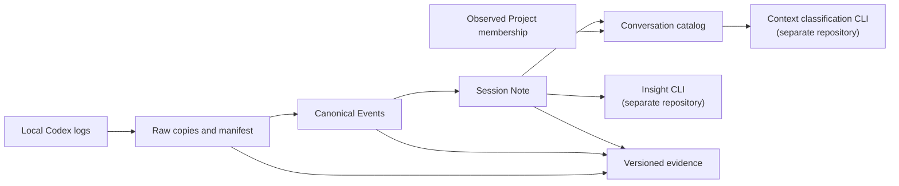

# Tkn Codex Chat Note Pipeline

日本語: [README_ja.md](README_ja.md)

> If you are new to this tool, sections 1–3 (What it does / Setup / Running the CLI) are enough to get started.
> Sections 4 onward provide reference information to consult as needed.

## 1. What it does

This local CLI preserves the conversation logs that Codex CLI stores locally and generates one Markdown note per conversation thread, referred to below as a **Session Note** or simply a note.

It performs three tasks.

1. **Preserve**: Copy Codex JSONL logs as Raw without modifying their contents.
2. **Structure**: Parse Raw into Canonical Events containing messages, timestamps, and line references to the original logs.
3. **Generate**: Pass Canonical Events to a generative AI model to create a Session Note.

A Session Note preserves requests, corrections, failed attempts, unresolved questions, a timeline with evidence IDs, and the last confirmed state.
It is a record for revisiting a conversation from different perspectives, rather than a brief summary.

### 1.1. Example of a generated note

This is an excerpt from the Timeline section.

```markdown
### 2026-05-17

- **11:27:35 - 11:27:47**
  - Actor: AI
  - Type: Action
  - Text: Investigated the publication scope and whether a listing could be retrieved.
  - EventRange: L000010 -> L000020
  - Sources: L000010, L000012, L000020
```

Each entry includes event IDs from the source logs that support it.
Timestamps and actors are determined programmatically from the cited events, rather than inferred by AI.
See [Session Note format](docs/reference/session-note-format.md) for the structure of a complete note.

### 1.2. Scope

| Item | Details |
| --- | --- |
| Conversation sources | Local Codex logs only |
| AI used for inference | Choose from Codex CLI / Claude Code / GitHub Copilot CLI / Ollama / Azure OpenAI |
| Output | Session Notes (Markdown), Raw copies, Canonical Events, and provenance |
| Out of scope | Capturing conversations from apps other than Codex, cloud-only history, Scope classification, Decision extraction, and Working Context generation |

**Conversation capture is exclusive to Codex.**
You can choose the AI used for inference independently.
Claude Code, Copilot, and Ollama are options for generating notes; the tool does not capture their conversations.

This CLI's processing ends with Session Note generation.
Session Note classification and Working Context are handled by [tkn_genai_context_curation_pipeline](https://github.com/tuckn/tkn_genai_context_curation_pipeline), and Decision extraction by [tkn_genai_insight_pipeline](https://github.com/tuckn/tkn_genai_insight_pipeline).
Each CLI can be installed independently and exchanges data through versioned files.

### 1.3. Terminology

| Term | Meaning |
| --- | --- |
| session | A continuous chronological conversation. One session corresponds to one Session Note. |
| conversation / thread | One conversation in Codex, identified by `threadKey`. |
| Raw | A byte-for-byte copy of the source logs. Its contents are not modified. |
| Canonical Events | Normalized events parsed from Raw, with messages, timestamps, and line references to the original logs. |
| source | A local Codex folder to read, identified by `source_id`. |
| inference provider / provider | The execution method used by AI to generate Session Notes: `codex`, `claude-code`, `github-copilot`, `ollama`, or `azure-openai`. |
| generation profile / profile | A named collection of settings such as provider, model, and limits. Select it with `--profile`. |
| provenance | Records of input hashes, IDs, and generation conditions, used to trace how an output was created. |
| generation conditions | The combination of input events, model, profile, prompt, chunking settings, and limits. Changes make affected notes eligible for regeneration. |
| intermediate results / cache | Temporary storage of validated chunk summaries and merged results. Reused when generation conditions match. |
| reviewed | A note marked as checked by a person. It is protected from overwriting. |

### 1.4. Overview



### 1.5. Four storage areas

| Area | Configuration key | Contents | Impact of losing it |
| --- | --- | --- | --- |
| Raw | `raw_root` | Copies of source logs and a manifest | Cannot be restored if the original logs have disappeared from the source |
| data | `data_root` | Canonical Events, Session Notes, catalog, and provenance | Outputs and published evidence are lost |
| state | `state_root` | Initialization information, per-conversation checkpoints, and run reports | Processing cannot resume; generation must be repeated |
| cache | `cache_root` | Intermediate generation results | Can be recreated, but regeneration takes time and may incur costs |

You can set `raw_root`, `data_root`, and `state_root` separately for each source.
`cache_root` is shared by all sources and cannot be configured per source.

## 2. Setup

### 2.1. Requirements

- Python 3.11 or later
- uv
- Readable local Codex JSONL logs (default location: `~/.codex`)
- One inference provider for generation; Codex CLI is the default

When using Codex, verify that `codex --version` and `codex login status` succeed in your terminal.
The ChatGPT desktop app (formerly Codex App) alone does not replace the CLI.

### 2.2. Install and create the configuration file

```console
cd "C:\path\to\tkn_codex_chat_note_pipeline"
uv tool install .
tkn-codex-chat-note --help
tkn-codex-chat-note config init
```

`config init` creates `~/.tkn/codex_chat_note_pipeline/config.yaml` and displays its path.
An edited configuration file is protected; it is backed up and replaced only when you specify `--force`.

### 2.3. Edit the configuration file

Open `config.yaml` at the displayed path and specify the source and the model to use for generation.
The following is a minimal configuration.

```yaml
schema_version: "8.1.0"
sources:
  my-windows-pc:
    enabled: true
    source_root: ~/.codex
    include_archived: true
generation:
  session_note_profile: default-jp
  active_profile: codex
  profiles:
    codex:
      provider: codex
      model: <model-name>
      reasoning_effort: high
```

The key under `sources` (`my-windows-pc` in this example) is the `source_id`.
When storage directories are omitted, data is stored under `~/.tkn/codex_chat_note_pipeline/<area>/codex/<source_id>`.
See [5. Configuration](#configuration) for available settings and [config.example.yaml](src/tkn_codex_chat_note/resources/config.example.yaml) for the bundled example.

```console
tkn-codex-chat-note config show
```

`config show` displays the effective settings, the configuration layer each value came from, resolved storage paths, and the selected summary profile and its hash.
It does not write any files.

## 3. Running the CLI

### 3.1. First run: clone

```console
tkn-codex-chat-note clone --dry-run
tkn-codex-chat-note clone
```

`--dry-run` reads local input and validates the execution conditions and plan.
It performs no inference or network access and creates no directories, locks, cache, or reports.

`clone` initializes storage that has not yet been created, preserves and normalizes all available history, and generates the target Session Notes.
Depending on the amount of history, **this can consume a substantial amount of inference time and tokens**.

When execution ends, a result summary and the run report's location are printed to standard error.
Open that report first to check the results.
Add `--full-output` if you need detailed JSON.

### 3.2. Daily updates: pull

```console
tkn-codex-chat-note pull
tkn-codex-chat-note status
tkn-codex-chat-note provenance validate
```

`pull` ingests new and changed logs, updates the affected notes, and resumes unfinished generation.
It does not call the model again for successfully generated notes whose input conditions have not changed.
Use an option such as `--limit 20` to limit how many notes the CLI attempts to generate in one run.
`status` displays records from the previous run (scope, status, and report path); it does not rescan the current input.
`provenance validate` checks the hashes, IDs, and provenance relationships in stored data without modifying it.

A conversation is considered active until `idle_minutes` (30 minutes by default) have elapsed since its last event, and summarization is deferred until a later run.
Its Raw data is saved first, even when summarization is deferred.

Completion is determined solely by Session Notes; it does not wait for downstream CLIs to generate Scope, Decision, or Working Context outputs.

### 3.3. Interrupting and resuming

You can interrupt `clone` and `pull` with `Ctrl+C`.

- Saved Raw data and completed notes remain intact.
- Validated chunk summaries and merged results are saved to the cache as processing progresses. Rerunning with the same generation conditions reuses saved results and restarts the part that was being generated at interruption.
- Cached results are not reused if generation conditions change or `--force` is specified. Corrupted intermediate results and parts whose cache has been deleted are regenerated.

An interruption displays `KeyboardInterrupt`, and the run report may not be marked complete.

### 3.4. Weekly runs with Windows Task Scheduler

After the initial `clone`, schedule a weekly `pull` under the same Windows user account you normally use to log in to the CLI.

| Setting | Value |
| --- | --- |
| Program/script | Absolute path to the installed `tkn-codex-chat-note.exe` |
| Arguments | `--config "C:\path\to\config.yaml" pull` |
| Start in | Choose a working directory that produces the same effective configuration as a normal run; a `.tkn/config.yaml` in that directory participates in configuration layering |

Place configuration options before `pull`.
If a WSL source is enabled, that user must be able to read the configured UNC path.

`runtime_minutes` (230 minutes by default) sets the deadline for starting new generation work.
Generation already running at that deadline has a grace period of up to 9 minutes.
Raw ingestion and normalization are not interrupted by this deadline.
Allow additional time in Task Scheduler's stop settings.

Interpret exit codes as follows.

| Exit code | Meaning | Action |
| --- | --- | --- |
| `0` | Success. Successful `--dry-run` plan validation also returns `0`. | None |
| `1` | Failure | Check the failure reason in the run report |
| `2` | Incomplete, for example because of `--limit`, active-conversation deferral, a runtime limit, or a budget stop | Resume with the next `pull` |

## 4. Commands

Place common options such as `--config`, `--profile`, and `--source` **before the command**.

| Command | Behavior |
| --- | --- |
| `config init` | Creates the bundled configuration. Protects edited settings; with `--force`, backs them up before replacement. |
| `config show` | Displays effective settings, their sources across the five configuration layers, and the summary profile hash. |
| `clone` | Initializes storage, captures all Raw data, and generates Session Notes. Can be rerun to resume. |
| `pull` | Applies changes to initialized storage and generates only the Session Notes still needed. |
| `raw ingest` | Ingests Raw data only; does not generate Session Notes. |
| `session-notes build` | Updates Session Notes. Use `--thread-id` to select a specific conversation. |
| `session-notes validate <artifact>` | Validates an existing note without modifying it. |
| `status` | Displays the previous run's scope, status, and report path. |
| `build-report [--dry-run] [--no-open]` | Build HTML/JSON/CSV from saved usage; open HTML by default. |
| `provenance validate` | Validates hashes, IDs, and provenance relationships without modifying data. |
| `storage migrate` | Copies data from the source specified by `--from-config` to new storage directories. |

The following options are available for commands that perform generation.

| Option | Behavior |
| --- | --- |
| `--dry-run` | Validates execution conditions and the plan without inference or file writes. |
| `--force` | Re-evaluates even unchanged input. Does not remove protection from reviewed files. |
| `--allow-edited` | Explicitly permits replacement of manually edited, unreviewed notes. |
| `--limit N` | Limits the number of notes for which generation is attempted in one run. It is not an API call or cost limit. |
| `--full-output` | Prints a detailed JSON report to standard output. By default, only the summary and report paths are displayed. |

`raw ingest` supports `--dry-run` and `--full-output`.

Generation and Raw ingestion commands print progress, result summaries, and run report paths to standard error.
Detailed JSON is printed to standard output only with `--full-output` (read-only commands such as `config show` continue to print JSON to standard output).
`-q` suppresses progress, and `-v` adds diagnostics.
Even when `session-notes build` targets one note, the run report includes processing status for all notes.

Before generation, each source reports `Session Notes up to date (no regeneration needed): 12/359`:
12 notes are current under the selected generation settings, out of 359 candidate sessions (including deferred sessions).
The count increases only after successful generation; failures, dry-run plans, and protected or deferred notes are not
counted as newly current. Already-current and newly generated counts are shown separately. Generation messages such as
`Starting thread (attempt 1 this run, limit 3)` count attempts in this source's run, not all candidate sessions.
The limit shown is the allowance remaining for this source; `--limit` is shared across sources.

<a id="configuration"></a>

## 5. Configuration

### 5.1. Configuration precedence

Later layers override earlier ones; higher numbers below take precedence.

1. Built-in defaults
2. User configuration (`~/.tkn/codex_chat_note_pipeline/config.yaml`)
3. `.tkn/config.yaml` in the current working directory
4. The file explicitly specified with `--config`
5. CLI options

Each configuration file is validated separately before merging.
Relative paths are resolved from the directory of the configuration file that declares the value.
The configuration schema version is `8.1.0`.
Keys use snake_case, and the version is written as a quoted SemVer string.
Unknown keys and unsupported newer versions produce errors.

```console
tkn-codex-chat-note --config "C:\path\to\config.yaml" clone
tkn-codex-chat-note --idle-minutes 0 --runtime-minutes 60 pull --limit 20
```

Across configuration layers, `sources` and `generation.profiles` are merged by map key, overriding only the specified fields of matching keys.
Explicitly defining a map in a layer replaces its built-in default entries, so adding your own `source_id` does not leave an extra default `windows` source enabled.
Use `sources: {}` to clear the entire source map or `enabled: false` to disable an inherited source (duplicate YAML keys are rejected).

### 5.2. Sources (sources)

`sources` lists the local Codex folders to read.

```yaml
sources:
  my-windows-pc:
    enabled: true
    source_root: ~/.codex
    include_archived: true
  my-wsl-ubuntu:
    enabled: false
    source_root: '//wsl$/Ubuntu/home/<user>/.codex'
    include_archived: true
```

| Key | Default | Meaning |
| --- | --- | --- |
| Map key | None | The `source_id`. Do not repeat `source_id` inside the value. |
| `enabled` | `true` | Disabled sources are not scanned, and their input folders do not need to exist. |
| `source_root` | `~/.codex` | Points to the parent `.codex` folder, not `sessions/`. Reads sessions, archives, and auxiliary app information. |
| `include_archived` | `true` | Includes archived conversations. |
| `raw_root` / `data_root` / `state_root` | Optional | Final storage directories. Defaults to `~/.tkn/codex_chat_note_pipeline/<area>/codex/<source_id>` when omitted. |

A `source_id` identifies an input folder that you continue to ingest over time.
**Lowercase ASCII kebab-case is recommended**, for example `laptop-windows` or `laptop-wsl-ubuntu`.
It is used as a configuration key, folder name, and provenance identifier, rather than a Python variable name.

- Allowed characters are ASCII letters (including uppercase), digits, `.`, `_`, and `-`; the first character must be alphanumeric.
- Spaces, Japanese or full-width characters, leading or trailing whitespace, and trailing dots are not allowed.
- Windows reserved names such as `CON`, `nul.txt`, and `COM1` are not allowed.
- IDs that differ only in letter case are rejected as duplicates. No automatic normalization is performed.
- Quote YAML keys that consist only of digits.

Published data is identified by `(codex, source_id)`.
Keep this identity fixed once ingestion begins to maintain compatibility with downstream tools.
Changing the key does not rename or migrate existing data.
Paths for `source_root` and storage directories can contain spaces and Japanese characters.
Do not register the same input folder under multiple IDs.

Use separate IDs for Windows and WSL input folders.
From Windows, you can use the UNC path shown above when the distribution is accessible.
When running this CLI inside WSL, configure Linux paths and the generation executable available there (`~` follows the OS running the CLI).
The WSL example illustrates configuration only; actual WSL operation has not been verified.
Per-account filtering is not implemented.

#### 5.2.1. Using multiple sources

Enabled sources are processed in their order in the map.

- `--limit` (generation attempts across the run) and `runtime_minutes` (the generation deadline) are shared across all sources.
- Catalogs, provenance, checkpoints, and run reports are kept per source, and all storage areas are validated before writing.
- A failure in one source contributes to the overall failure result, but other sources can continue.

```console
tkn-codex-chat-note --source my-windows-pc pull
tkn-codex-chat-note --source my-windows-pc session-notes build --thread-id <thread-id>
```

Place `--source` before the command to select one source for processing, `status`, `provenance validate`, or `storage migrate`.
When omitted, processing, `status`, and `provenance validate` target all enabled sources.
If multiple sources are enabled, select one with `--source` when using `--thread-id` or `storage migrate`.
Specifying an unknown ID or a disabled source produces an error.
`config show` always displays configuration and resolved storage paths for all sources.

If no sources are enabled, execution stops before writing (`config show` remains available).

### 5.3. Session Note language

Use `generation.session_note_profile` to select `default-jp` (Japanese, the default) or `default-en` (English).

```yaml
generation:
  session_note_profile: default-jp
```

For a single run, use an override such as `tkn-codex-chat-note --session-note-profile default-en pull`.

Both profiles share the same schema, headings, timeline, citations, and state evaluation.
Only the body language and explanatory text change; timestamps remain in `Asia/Tokyo`.
Bundled resources are located in `profiles/default-jp/` and `profiles/default-en/`; custom profile names, folders, and prompts are not supported.

Changing the language makes existing notes eligible for regeneration on the next `build` / `pull`.
Notes in different languages do not coexist: each conversation retains one note and one ID.

<a id="inference-configuration"></a>

### 5.4. Inference providers (generation.profiles)

Keys under `generation.profiles` are arbitrary configuration names.
Each configuration explicitly specifies its execution method with `provider`.
The method is never inferred from the name, executable, or URL.

| `provider` | Connection setting | Execution method |
| --- | --- | --- |
| `codex` | `executable: codex` | An independent `codex exec` invocation |
| `claude-code` | `executable: claude` | Non-interactive Claude Code |
| `github-copilot` | `executable: copilot` | Non-interactive Copilot CLI |
| `ollama` | `endpoint: http://127.0.0.1:11434` | Local chat endpoint; loopback only |
| `azure-openai` | `endpoint: https://<resource>.openai.azure.com/openai/v1/` | v1 Chat Completions |

`executable` is the CLI executable name or path, and `endpoint` is the HTTP connection URL.
Place Azure's `authentication`, `pricing`, and `limits` at the same level as `model`.

Here is an example using a local model.

```yaml
generation:
  active_profile: local-gemma
  profiles:
    local-gemma:
      provider: ollama
      model: <installed-local-model>
      reasoning_effort: high
      endpoint: http://127.0.0.1:11434
```

You can define multiple configurations for the same provider, such as `azure-high` and `azure-low`.

```console
tkn-codex-chat-note --profile azure-high pull --dry-run
```

- `--profile` changes only `generation.active_profile`. It does not change the source.
- `--model` and `--reasoning-effort` override the selected profile for that run only.
- `--profile` (generation profile) and `--session-note-profile` (note body language) are separate settings.
- Even when a profile name matches a provider name, the execution method is not inferred from the name.
- Run reports and provenance record `generationProfile` separately from provider and model.

For CLI-based providers, the selected generation input is sent to the service configured in that CLI.
Choose a destination appropriate for your conversation data (Ollama endpoints are restricted to loopback).
Available models and authentication are managed by each service.

### 5.5. Input size and cost controls (Azure OpenAI / Ollama)

Azure OpenAI and Ollama configured with `limits` support estimates before submission, actual usage tracking during execution, and stopping at limits.
Input size, including instructions and schemas, is checked before every chunk, merge, and repair request; chunks are adjusted automatically until they fit.
If a repair would exceed the input limit, the oversized request is not submitted. Instead, the tool regenerates from the complete original chunk or merge input without the invalid draft. It includes validation feedback when it fits, shortening or omitting only that feedback if necessary. The result must pass the same validation, within the existing maximum of three generation attempts per stage and the command's call/cost limits. Validated checkpoints remain reusable.
An original merge input that exceeds the limit still stops that thread while retaining saved chunks; adjust the limits or merge method before resuming.

The Japanese profile asks the model to write natural Japanese. English phrases such as `supplied events` or `actual execution` alone do not trigger warnings, repair calls, or generation failures. Output structure, source citations, timeline coverage, and state consistency are still validated. Actual validation failures are recorded in `generationMetrics.validationFailures`; `repairFallbacks` records regeneration caused by an oversized repair request.
Warnings appear in yellow on supported terminals. Redirected output and terminals with `NO_COLOR` remain plain text.

#### 5.5.1. Azure configuration

```yaml
generation:
  active_profile: azure-high
  profiles:
    azure-high:
      provider: azure-openai
      model: <deployment-name>
      reasoning_effort: high
      endpoint: https://<resource>.openai.azure.com/openai/v1/
      # Optional settings below
      # authentication:
      #   tenant_id: <tenant-guid>
      # pricing:
      #   <deployment-name>:
      #     input_jpy_per_million: 100.0   # Placeholder rates; replace with verified rates
      #     output_jpy_per_million: 500.0
      #     pricing_date: YYYY-MM-DD
```

Set `model` to the **deployment name** to call.
The actual model name and version are recorded from API responses, so you do not need to specify them in configuration.
A note's `generatorModel` identifies the model that actually responded, while `generatorDeployment` identifies the requested deployment (provenance records them separately as well).

Configure `pricing` only if you want monetary amounts displayed.
If no matching rates are available, only token estimates and actual usage are shown; the cost is reported as unknown and **the JPY limit is not enforced** (input, output, and call limits still apply).
Costs are estimates based on user-configured rates, not billing information retrieved automatically from Azure.
Changing the deployment with `--model` or another setting does not reuse another deployment's rates.

Azure CLI is not required for authentication.
The SDK uses browser authentication and a persistent cache, first attempting to obtain a token with saved authentication and opening a browser only when interaction is required.

- Account records are stored in `~/.tkn/codex_chat_note_pipeline/authentication/`, and tokens are stored in the SDK's encrypted cache (there is no fallback to plaintext storage).
- Cache names are isolated by this app, endpoint, and tenant. Authentication belonging to other apps or Azure CLI is not copied or modified.
- To select a different account, stop execution and delete only this app's corresponding account record.
- `--dry-run` does not authenticate or open a browser. Authentication cancellation or timeout stops execution before inference is submitted (`pull` may already have ingested history).

#### 5.5.2. Limits (limits)

`limits` is optional.
The defaults below do not describe the capabilities of every deployment.

| Key | Default | Meaning |
| --- | --- | --- |
| `input_tokens` | 60,000 | Input limit per call |
| `output_tokens` | 16,000 | Output limit per response, including reasoning |
| `context_tokens` | 100,000 | Context limit |
| `chunk_characters` | 120,000 | Chunk size in characters |
| `max_calls` | 30 | Call limit per command |
| `max_cost_jpy` | 100 | Reserved cost limit per command; applies only when rates are configured |

For Ollama, you can configure `limits` and a pinned `model_digest`.
`context_tokens` and `output_tokens` are passed as `num_ctx` and `num_predict`.
A tokenizer-independent UTF-8 byte upper bound is used, which can produce more chunks.
When `limits` is omitted, execution is unbounded.

#### 5.5.3. Estimates before execution (dry-run)

```console
tkn-codex-chat-note pull --dry-run --limit 1
```

- Only notes requiring generation are estimated. Up-to-date, reviewed, edit-protected, and deferred notes are excluded, as are reusable validated chunk-cache results.
- Because the final merge input size cannot be determined in advance, the estimate reserves one merge call.
- No files are created, and no authentication or communication takes place. `--full-output` also displays `generationEstimate` for each conversation.
- A dry run does not save a report. To retain its plan, save the standard output produced with `--full-output` to a file.
- For command-based providers such as Codex, token counts and costs are unknown because the CLI's internally added context and schema are not visible. Azure also displays estimated total input tokens, the output token ceiling, and the estimated cost ceiling in JPY.
- Azure token estimates use a validated local `o200k_base` cache with a margin. If unavailable, a UTF-8 byte upper bound is used and recorded as `utf8-byte-upper-bound`.

#### 5.5.4. Reading progress output

During execution, standard error shows each call's input estimate and reserved cost, actual response token counts and estimated JPY cost, and per-conversation and overall summaries.
Unknown usage or local execution costs are never displayed as 0.
For a conversation split into 12 chunks, interpret the output as follows.

| Display | Meaning |
| --- | --- |
| `13 base calls` | 12 chunk summaries + 1 merge |
| `output ceiling 208,000 tokens` | 13 calls × a 16,000-token output limit |
| `base cost ceiling JPY 53.64 (repairs/retries extra)` | A conservative ceiling estimate based on estimated input and maximum output for the base processing. Content repairs and communication retries are additional. |
| `16 model calls, 3 semantic retries, ... estimated JPY 28.69` | 12 chunks + 1 merge + 3 content repairs = 16 submitted calls. Tokens come from API responses; JPY is calculated using configured rates. |
| `command reserve` | Reserved cost for the entire command, including earlier notes and other sources |
| `no request submitted` | This call was not submitted and incurred no charge; usage and costs from earlier submissions remain |

Reserved cost accumulates the cost of estimated input plus maximum output; a short response does not release the reservation.
As a result, processing can stop at the default JPY 100 reservation limit even when the estimate based on actual usage is below JPY 100.
None of these JPY amounts is a confirmed Azure bill.

Run reports are saved under `<state_root>/reports/` with run IDs.
They retain estimates before generation (`generationEstimate`), per-call actual usage, reserved cost, and responding models (`generationMetrics.apiRequests[]`, including failed attempts), and per-conversation and overall totals (`usageTotals`).
If any call's usage is unavailable, the total is `null`, with a separate subtotal for known usage.
For analysis that includes runs resumed after failure, aggregate the reports for each run (also adding `last-run.json` or copies of standard output would double-count usage).

#### 5.5.5. Budget stops and resuming

At the first rejection caused by a cost or call limit, further generation stops and unfinished work is marked `deferred`.

- One warning is displayed, and no further estimation or generation is performed. The stop applies across all selected sources.
- Up-to-date notes and review protection are preserved as usual; source ingestion and final report saving may continue.
- The report's `generationStop` records the reason, reserved cost, call count, and limits. The deferral reason is `api-cost-budget` or `api-call-budget`; if there are no other failures, the exit code is `2`.
- The budget applies to one command. A separate command or process receives a new allowance. Azure cost notifications do not stop charges.

To resume, keep the same profile and settings and run without `--force`.

```console
tkn-codex-chat-note --profile azure-high pull --limit 1
```

Completed, unchanged notes are skipped, and validated chunks are reused.
Each new command receives a new budget allowance, so even a large conversation with 36 chunks plus a merge can progress across multiple commands under a 30-call limit (additional submissions incur additional costs).

Reconsider `limits.max_cost_jpy` and `limits.max_calls` only if even one required call cannot fit within a fresh allowance (raising only the cost limit does not remove the call limit).
Limits are part of the generation conditions, so changing them can make existing intermediate results ineligible for reuse and completed, unreviewed notes eligible for regeneration.
The application never increases configured limits automatically.

#### 5.5.6. Submitted content and retries

- To reduce input size, identical duplicate content is replaced with references to its original events, and source IDs are converted to short, reversible aliases before submission. Raw, Canonical Events, and all event IDs are preserved; responses are restored to the original IDs before validation.
- Refusals, truncated responses, and 401/403 errors fail without retries. A 429 or transient error allows up to 3 attempts, respecting `Retry-After` (if the requested wait exceeds 60 seconds, processing stops and advises resuming after that interval).
- Intermediate results retain the responding model's identifier. If a later response differs, processing stops without mixing results (regenerate with `--force`).

### 5.6. How configuration changes affect regeneration

| Changed setting | Effect |
| --- | --- |
| `session_note_profile` (language) | Existing notes become eligible for regeneration. Intermediate results from a different profile are not reused. |
| `provider` / `model` / `reasoning_effort` | Generation conditions change, making notes eligible for regeneration. |
| `endpoint` / `deployment` / `limits` / `model_digest` | Generation conditions change; previous intermediate results are not reused. |
| Profile name only | Does not invalidate intermediate results. |
| Switching `active_profile` | Does not change storage locations. |
| `raw_root` / `data_root` / `state_root` | Only storage locations change; no regeneration occurs (use `storage migrate` for migration). |

Protection for reviewed and manually edited notes remains in effect in all cases.

### 5.7. Token usage history and HTML reports

Starting with 0.24.0, Codex inference records actual token usage for clone, pull, and
session-notes build. This measures this pipeline's generation, not the usage of the original chats.

- Codex reads turn.completed.usage from codex exec --json: input, output, cached input, reasoning, and cache-write counts when supplied.
- Azure OpenAI and Ollama configured with limits also write the common usage history.
- Claude Code, GitHub Copilot, and Ollama without limits currently record attempt time/status with unknown token counts.
- Failed attempts and retries are included. Missing values remain null, never zero or a preflight estimate.
- Codex records invocation-wide turn totals; API records are per request. Attempt counts are not the same granularity across transports.
- Cached input is part of total input; reasoning is part of total output. Do not add either subset again.

History lives at <state_root>/usage/<runId>/<usageId>.json. A started record is saved before
inference and updated after each attempt, followed by the note's outcome. A hard interruption can
leave a started record with unknown consumption. Prompts, answers, and credentials are not stored
in usage history. Run reports also contain generationMetrics.usageRecords and usageTotals.
The API-only apiRequests compatibility view remains; do not sum it with usageRecords.
Back up state: usage history is durable application data, not disposable cache.

These commands use saved records only, without inference, price lookup, or scanning original chats:

~~~console
tkn-codex-chat-note build-report --dry-run
tkn-codex-chat-note build-report
tkn-codex-chat-note build-report --no-open
~~~

Normal execution writes HTML/JSON/CSV and opens the HTML. --no-open suppresses opening only;
--dry-run validates and aggregates without writing or opening. All history from all enabled sources
is included by default. Put --source <source_id> before the command to replace the report with that source alone.

The default destination is ~/.tkn/codex_chat_note_pipeline/reports, configurable with report_path.

| Output | Contents |
| --- | --- |
| index.html | Offline HTML with execution date, model, provider, command, source, generation-profile, and thread filters |
| usage.json | Normalized records, source-file SHA-256 hashes, aggregation settings, price scenarios, and missing-data information |
| diagnostics.csv | Saved warnings, errors, validation failures, retry summaries, and deferred/blocked outcomes with task and run context |
| usage.csv | One row per attempt; empty token cells mean unknown. Formula-like strings are protected for spreadsheet readers |

HTML embeds its own data and works alone. Keep all four files together to use its JSON/CSV links.
Exports contain the full snapshot, not the current UI selection. Rebuilds replace these files;
input history is untouched. Each file is replaced atomically and HTML is published last.
Do not read exports during a build; rerun after an interruption. HTML always uses its embedded snapshot.

From 0.25.0, the timeline switches between input/output, model, and model × input/output.
Legend buttons hide/show chart series; page filters apply to every section. A numeric table accompanies the chart.
Task rows show the current note Frontmatter title and filename, falling back to the saved task title or ID.
Search by title, filename, or task ID. Only bounded Frontmatter is read from referenced notes inside data_root;
missing, moved, or malformed notes do not prevent the report from building. Titles describe the current note,
not its historical contents. Note bodies are never included. Source hashes distinguish full evidence files
from the decoded Frontmatter content (UTF-8, LF newlines, excluding delimiter lines).

The warning/error section shows saved messages, stages, task/run identities, and final note outcomes,
including runs without token records. Filter by severity, category, or message. INFO includes budget/time
or protection-related deferrals; an explicit budget stop is a WARNING. Validation warnings can remain after
successful repair. Models on run-level diagnostics indicate the models observed in that run, not attribution
of the cause; unknown identifies diagnostics without observed models. Terminal-only warnings and unsaved
failure details cannot be recovered. Diagnostic counts count records, not unique failed tasks.

Use the top-ten task ranking, stage totals, per-model repair tokens/shares, and repeated successful-generation
counts to find expensive tasks to inspect. Repair usage includes repair/regenerate stages and is distinct from
transport retries. These are operational signals, not quality scores or controlled model comparisons.
Read the actual notes and source evidence before deciding whether their summaries meet your needs.

Daily/weekly/monthly views use generation start dates, in UTC by default; set 540 minutes for Japan.
Historical API run reports are imported and deduplicated against the journal. Earlier ephemeral Codex
usage cannot be reconstructed if it was not recorded. Known sums, missing attempts, and unfinished
attempts are distinct. Per-note averages with missing usage are lower-bound references.

Reference prices live in usage_report.price_scenarios, independently of inference budgets.
Changing scenarios never regenerates notes or invokes models. These are fictional example prices:

~~~yaml
schema_version: "8.1.0"
report_path: ~/.tkn/codex_chat_note_pipeline/reports
usage_report:
  utc_offset_minutes: 540
  price_scenarios:
    comparison-model:
      currency: USD
      pricing_date: "2026-09-19"
      input_per_million: 1.0
      output_per_million: 5.0
      cache_policy: no-cache
~~~

no-cache prices all input at the ordinary input rate. observed uses measured cache counts and requires
cached_input_per_million. If cache_write_per_million is supplied, cache-write counts must also be known.
Missing required counts make the scenario unavailable for that attempt, not zero cost.

Costs answer “what would the same token counts cost at these rates?” They are not invoices or predictions
of another model's tokenization, reasoning, answer length, or retries. Subscription fees, tool fees, taxes,
and currency conversion are excluded. Separately priced cache reads/writes are subtracted from ordinary
input before applying their rates. Reasoning is never added again to total output.
With no configured prices, the report still shows usage. No prices are fetched automatically.

## 6. Storage layout

Default storage paths follow this order: area role → source application → source environment → data type.
When a root such as `raw_root` is specified explicitly, data types are placed directly beneath that root.

In the following table, `P` is the capture provider (always `codex`), `I` is the `source_id`, `T` is the `threadKey`, and `H` is the content hash.

| Storage path | Contents |
| --- | --- |
| `<raw_root>/sessions/...` | Latest copies preserving the relative structure and bytes of the original Codex logs |
| `<raw_root>/archived_sessions/...` | Latest copies preserving Codex's archive structure |
| `<raw_root>/manifest.jsonl` | Raw manifest recording sources, references, and hashes |
| `<raw_root>/metadata/H.json` | Observed app Project information |
| `<data_root>/source-aligned/T/H.json` | Canonical Events with references to positions in the original logs |
| `<data_root>/session-notes/YYYY/MM/...md` | Current Session Notes organized by the conversation's start year and month |
| `<data_root>/catalog/threads.json` | Catalog of this source's conversations, memberships, states, and note references |
| `<data_root>/provenance/...` | Immutable snapshots, entities, activities, and a published index for this source |
| `<state_root>/pipeline.json` | Per-source initialization information and storage version |
| `<state_root>/threads/T/...` | Internal checkpoints per conversation |
| `<state_root>/ledger.json`, `reports/`, `last-run.json`, `normalization/` | Per-source execution and normalization state |
| `<cache_root>/P/I/...` | Reusable intermediate generation cache per source |

For example, with `source_id` set to `my-windows-pc` and storage directories omitted, Raw is stored under `~/.tkn/codex_chat_note_pipeline/raw/codex/my-windows-pc/sessions/...`, and notes under `~/.tkn/codex_chat_note_pipeline/data/codex/my-windows-pc/session-notes/YYYY/MM/...md`.
The `codex` path segment is retained for compatibility.
Use `config show` to inspect each source's final storage directories under `storage.sourceRoots.<source_id>`.

When choosing storage locations:

- Keep all roots separate from one another and from the source's `source_root` and configuration files.
- Placing `raw/`, `data/`, and `state/` under a common parent makes it easier to back them up or move them together.
- State is persistent data for resuming processing and maintaining checkpoints; manage it together with data.
- Published evidence is retained in provenance under data.
- Cache can be recreated and is not copied during migration.

Each root contains an ownership marker with the source ID and a lock; reuse for a different source is rejected.
Even when the same conversation `threadKey` exists in another environment, note IDs, checkpoints, catalogs, and provenance remain independent per source.
See the [output data and CLI integration contract](docs/reference/data-contract.md) for how references in output files (`data:/` and `raw:/codex/<source_id>/`) are resolved.

<a id="processing-flow"></a>

### 6.1. How session-notes build works

`session-notes build` preserves and normalizes conversation logs as Raw, then generates Markdown Session Notes for the target conversations.
Use `--thread-id` to select one conversation.
This command does not generate Decisions or Working Context.
The AI receives event contents, event IDs, generation instructions, and an output schema.

The following table defines the abbreviations used in the diagram.

| Diagram label | Configuration setting | Default storage path |
| --- | --- | --- |
| `C` | `sources.<source_id>.source_root` | `~/.codex` |
| `R` | `sources.<source_id>.raw_root` | `~/.tkn/codex_chat_note_pipeline/raw/codex/<source_id>` |
| `D` | `sources.<source_id>.data_root` | `~/.tkn/codex_chat_note_pipeline/data/codex/<source_id>` |
| `S` | `sources.<source_id>.state_root` | `~/.tkn/codex_chat_note_pipeline/state/codex/<source_id>` |

`T` is the conversation's `threadKey`, and `H` is the content hash.

```mermaid
sequenceDiagram
    autonumber
    actor U as User / scheduled run
    participant P as Pipeline CLI
    participant C as Codex storage
    participant F as Storage R / D / S
    participant AI as Generative AI

    U->>P: session-notes build
    P->>P: Read config.yaml<br/>Storage paths, source ID, model
    P->>F: Read S/ledger.json and related files<br/>Check previous processing state

    P->>C: C/sessions/**/*.jsonl<br/>C/archived_sessions/**/*.jsonl
    C-->>P: Original conversation log bytes
    P->>F: R/sessions/YYYY/MM/DD/rollout-*.jsonl<br/>Save without changing the original contents
    P->>F: R/manifest.jsonl<br/>Record sources, timestamps, and hashes

    opt Project membership information is available
        P->>C: C/.codex-global-state.json
        C-->>P: Project information and conversation membership
        P->>F: R/metadata/H.json<br/>Snapshot of membership information
    end

    P->>P: Parse Raw and normalize events<br/>Conversation IDs, messages, timestamps, original line references
    P->>F: D/source-aligned/T/H.json<br/>Save Canonical Events

    loop New, changed, or unfinished target conversations
        P->>P: Prepare events for summarization<br/>Split long conversations into chunks
        P->>AI: Conversation ID, event contents, event IDs<br/>Generation instructions and output schema
        AI-->>P: Partial records as JSON<br/>Timeline text, summary, and evidence IDs
        opt Conversation was split into chunks
            P->>AI: Merge summaries and final states from partial records
            AI-->>P: Summary and final state as JSON
        end
        P->>P: Join timelines while retaining partial records<br/>Validate timestamps, actors, and evidence; render Markdown
        P->>F: D/session-notes/YYYY/MM/*.md<br/>Save Session Note
        P->>F: Record provenance and processing checkpoints
    end
```

The stored Canonical Events and the events used for summarization come from the same parsing results (events are passed in memory without rereading the saved JSON).
At this stage, the unit of summarization is a conversation, independent of consolidation by work scope.

### 6.2. Moving storage to another folder

Use `storage migrate` to move a store in the current format to another folder.
It copies Raw, Session Notes, normalized data, provenance, and resume state while preserving note IDs, contents, and review status.
No inference is performed, so changing storage locations alone does not regenerate notes.

1. Prepare a source configuration file that independently resolves the source's final storage paths and source ID. Configuration from other layers is not merged into the `--from-config` file.
2. Prepare a separate destination configuration with the same source ID, setting `raw_root`, `data_root`, and `state_root` to new final storage directories that do not overlap the source. If multiple sources are enabled, select one with `--source`.
3. Stop writes to the source during copying, then check and execute in the following order.

```console
tkn-codex-chat-note --config "C:\path\to\destination.yaml" config show
tkn-codex-chat-note --config "C:\path\to\destination.yaml" --source my-windows-pc storage migrate --from-config "C:\path\to\source.yaml" --dry-run
tkn-codex-chat-note --config "C:\path\to\destination.yaml" --source my-windows-pc storage migrate --from-config "C:\path\to\source.yaml"
tkn-codex-chat-note --config "C:\path\to\destination.yaml" --source my-windows-pc provenance validate
```

Source data and configuration are not modified or deleted.
Cache is not copied; it is recreated at the destination.
A conflict at the destination stops the operation, and an interrupted copy can be resumed with the same settings (rerunning a completed copy performs no writes).
Use the destination configuration for subsequent runs, and update downstream CLIs' `notes_roots` paths while keeping input names unchanged.
See the [output data and CLI integration contract](docs/reference/data-contract.md#storage-layout-5) for copy guarantees.

### 6.3. Rebuilding without retaining existing data

Create a new configuration file, specify empty `raw_root`, `data_root`, and `state_root` directories, and follow [3. Running the CLI](#3-running-the-cli).

```console
tkn-codex-chat-note --config "C:\path\to\rebuild.yaml" config init
```

Edit the created configuration, and use the same `--config` for subsequent `config show` and `clone` commands.
Only conversation logs still present in the source can be rebuilt.
Because this creates a separate store, it does not retain old note IDs, manual edits, or review status.
Specifying `--config` does not bypass validation of lower configuration layers, so any user configuration or `.tkn/config.yaml` that is loaded must also use a valid schema.

## 7. Coverage and limitations

### 7.1. Capture scope

- Local `sessions` and, by default, `archived_sessions` are included.
- Conversations without a Project, with an unknown assignment, or with ambiguous membership are also included. Conversations can be preserved without the app's Project information.
- Cloud-only ChatGPT / Work history is not captured.
- Internal processing and approval-review conversations, and logs without ordinary user messages, are preserved and normalized but excluded from summarization.
- Older log formats are included. When an event has no timestamp, the note marks the time as unknown.
- `inter_agent_communication_metadata` (such as `trigger_turn`) is retained in Raw as known control information and is not used as evidence for summarization.
- Unsupported records and invalid JSONL are recorded in the run report. Unicode separator characters are not mistaken for JSONL line breaks.

### 7.2. Images and long text

Embedded image payloads are preserved in Raw and normalized data.
Text inference receives the image format, byte count, and hash instead of the base64 payload, and the note explicitly states that visual content has not been verified.
Ordinary long text is preserved and split according to input size.

### 7.3. Multiple files for the same conversation

Exact matches and byte-level append relationships are consolidated as duplicates.
Other histories and branches are preserved, with timelines and sources shown by History ID within one Session Note (the tool does not infer which branch was adopted or whether another history superseded it).
All files are saved in Raw, and each input remains in normalization and note-generation provenance.
`history_base` is recorded as source metadata.
A branch change regenerates the same note ID; an unchanged `pull` does not regenerate it.

### 7.4. Nature of generated results

- A Session Note is a derived record and does not replace the original evidence.
- Unresolved or unverified items from each chunk remain in the final note unless later events in the same history show that they were resolved. Completing the latest request does not automatically clear earlier unverified items.
- Each pending item carries its own source citations in internal `pendingStateItems`, indexed by kind and position in the partial's pending list. The overall final-state citations are not reused as every item's origin. Missing, duplicate, or unknown item citations require repair.
- The merge generates item reviews before the final state. Resolution requires later evidence in every relevant history; that evidence remains in the final state's citations. Retained unresolved requests prevent `done`; retained unverified checks alone do not. Contradictions are reported for repair without silently dropping requests or guessing a replacement status.
- Run reports record the item text and origins in `generationMetrics.stateItems` and successful reviews in `stateItemReviews`. Internal item evidence stays in generation checkpoints and does not change the published Session Note schema. The updated generation contract invalidates older generation fingerprints/checkpoints on the next build; reviewed and edited notes retain their existing protection. This adds no separate inference stage, but item citations increase the generated payload.
- The model judges whether a source actually shows resolution, so factual verification remains necessary.
- Changing Project membership does not change the conversation ID. This CLI retains observed membership, while downstream CLIs handle semantic Scope classification and approved relationships.

### 7.5. Execution environment

If Windows temporarily refuses a file replacement, the CLI briefly retries while preserving the original file.
Persistent errors are recorded as failures in the run report.

The minimum supported version is Python 3.11, but the recorded execution environment is Windows / Python 3.12.10.
Other Python versions and non-Windows environments, including WSL, have not been verified.

## 8. Reinstalling after updates

Reinstall after updating code or resources.

```console
cd "C:\path\to\tkn_codex_chat_note_pipeline"
uv tool install . --reinstall
```

## 9. Development and verification

```console
uv sync --locked
uv run python -m pytest
uv run python -m ruff check .
uv run python -m mypy src
uv build
```

Automated tests use anonymous conversation data and inference test doubles to check configuration, storage, resuming, edit protection, and generated-output validation.
They do not guarantee authentication with real services or summary quality from real models.
Use temporary directories managed by the test framework or OS for temporary data.

When changing distribution artifacts, install the built wheel into a temporary environment and check `--version`, `--help`, `config init`, `config show`, and bundled language profiles from outside the checkout.
When changing the integration contract, use anonymous outputs to verify IDs, hashes, and input references in downstream CLIs.

To compare note quality separately from live data storage, run `scripts/evaluate_session_notes.py` against a dedicated evaluation directory (specify `--manifest`, `--config`, `--output`, and `--thread`; `--dry-run` validates the plan only).

## 10. Related documentation

| Document | When to read it |
| --- | --- |
| [Output data and CLI integration contract](docs/reference/data-contract.md) | Implement a tool that consumes the output: IDs, schemas, hashes, provenance, and consistency checks |
| [Session Note format](docs/reference/session-note-format.md) | Understand the structure of generated notes and the meaning of each field |
| [Azure structured outputs](https://learn.microsoft.com/en-us/azure/foundry/openai/how-to/structured-outputs) | Understand the structured output specification for Azure requests |
| [Browser authentication](https://learn.microsoft.com/en-us/python/api/azure-identity/azure.identity.interactivebrowsercredential) | Understand Azure interactive authentication |
| [Ollama chat API](https://docs.ollama.com/api/chat) | Understand the Ollama endpoint specification |
