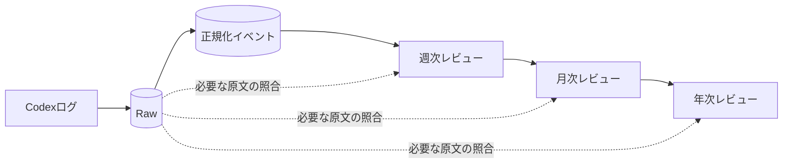

# tkn-codex-chat-note: Tkn Codex Chat Note Pipeline

ローカルのCodexチャットをRawとして保存し、**週次・月次・年次のReview Note**を生成するCLIです。人が読むMarkdownと、生成AIが再利用する出典付きJSONを保存します。

## 1. これは何か


```mermaid
flowchart LR
    CHAT[Codexログ] --> RAW[(Raw)]
    RAW --> EVENTS[(正規化イベント)]
    EVENTS --> WEEK[週次レビュー]
    WEEK --> MONTH[月次レビュー]
    MONTH --> YEAR[年次レビュー]
    RAW -. 必要な原文の照合 .-> WEEK
    RAW -. 必要な原文の照合 .-> MONTH
    RAW -. 必要な原文の照合 .-> YEAR
```

Raw取得・正規化は機械処理です。生成AIを使うのはレビュー作成です。月次は週次、年次は月次を主入力とし、不足する期間は下位レビューや正規化イベントで補います。各sourceを独立に処理し、source内の複数チャットを横断して振り返ります。

レビュー入力では会話を保持し、通常のツール本文を会話別の索引へ圧縮します。終了コードや診断文字列に問題の兆候がある出力は短い抜粋を残し、重要な結果・原因はRawで照合します。索引の件数はログ件数であり、独立した実行回数ではありません。正規化に失敗した会話は不足情報として明示します。

質問・説明・実施事項・判断理由・未解決事項に加え、Intelligence Layerへの候補と生成AIの挙動改善案を、出典・留保・次の確認事項とともに残します。推測や提案を事実として扱わず、Vault・Skill・AGENTS.mdへ自動採用しません。

### 1.1. 生成されるノートの例

以下は週次Review Noteの本文例です（説明用の架空データ）。

```markdown
保存資料を再利用する作業と、検証手順を見直す作業がつながった週だった。
既存情報を最初に確認できることが、両方の作業を支える可能性がある。[S001] [S002]

## テーマ別の実施・判断・残る点

| テーマ | 実施・結果・判断と理由 | 残る点・確認案 |
|---|---|---|
| 資料の再利用 | 既存ノートを見つけた後、再作成から追記へ方針を変更した。[S001] | 他の資料でも同じ索引が使えるかは未確認。 |

## 生成AIの挙動改善案

| 観察された問題 | 根拠と改善案 | 適用上の留保 | 確認方法 |
|---|---|---|---|
| 既存資料の見落とし | 配置を仮定して探索に失敗した。次回は資料の索引を開始時に渡す。[S001] | 反復する問題かは未確認。 | 次の作業で再探索が減るか確認する。 |
```

週次・月次・年次とも、最終統合でテーマ別に編集します。質問・活動は表、複数チャットの考察は文章、AI改善案は確認方法付きの表にします。詳細な抜粋はJSONに保持し、Markdownの出典は文書単位の参照にまとめます。単一バッチでも抽出後に最終統合を1回行い、複数バッチでは最後の統合をこの編集に使います。[Review Noteの仕様](docs/reference/review-note-format_ja.md)を参照してください。

保存前には自動校正を行います。抽出結果との照合で重要な話題の抜けを確認し、引用の重複だけで照合を省略せず、関連する抽出項目の原文も渡して後続訂正・完了報告を確認します。概要は本文の校正後に照合し、判断・完了状態を揃えます。無関係な話題の分離や、説明文の再利用目的・作業場所のルールの扱いも校正対象です。校正が完了しないノートは公開せず、上限到達時は次回に再開します。意味の正しさを保証する処理ではありません。

本文を膨らませないため、統合時は最大32項目・日本語7,000文字、校正後は最大36項目・8,400文字を検証します（タイトル・本文・留保・確認案の合計）。復元は重要事項6件まで、新しい話題はそのうち2件までです。各項目の文字数枠の合計も全体上限内に配分し、変更しない項目も検証します。照合した項目と理由はJSONに残します。週次・月次・年次とも、全作業の列挙ではなく主要テーマを選ぶレビューです。

校正は追加のモデル呼出しを伴います。空の期間は0回、それ以外は根拠校正が最低1回、完全一致しない抽出項目があれば欠落照合も1回以上、概要があれば本文との照合が概要1件につき1回増えます。実際の回数は本文と引用の量で増えます。共通の根拠を持つ項目は同じ校正リクエストへまとめ、原文を削らず重複送信を減らします。送信時のみ根拠IDを短縮し、検証・保存前に元のIDへ戻します。確認済みcacheも再利用しますが、呼出しごとのモデル側の入力や推論・出力トークンも増えるため、最初の数回は利用量レポートで確認してください。

### 1.2. 対象範囲

| 項目 | 内容 |
|---|---|
| 取得元 | ローカルのCodexログ（保存済みアーカイブを含む） |
| 出力 | Raw、正規化イベント、catalog・provenance、週次・月次・年次Markdown＋JSON |
| 生成AI | Codex、Claude Code、GitHub Copilot CLI、Antigravity、Ollama、Azure OpenAI |
| source | PC・環境等の取得元。source間のレビューは統合しない |
| 対象外 | 会話ごとのSession Note生成、クラウドだけにある履歴の取得、候補の自動採用 |

## 2. セットアップ

Python 3.11以上とuvを使用します。生成プロバイダーは別途インストール・認証し、共有Bridge設定に実行プロファイルを用意してください。

```shell
cd <repository>
uv tool install .
tkn-codex-chat-note --help
tkn-codex-chat-note config init
```

ソースやリソースの更新後は `uv tool install . --reinstall` でインストール済みCLIへ反映します。

### 2.1. 設定

設定先は `~/.tkn/codex_chat_note_pipeline/config.yaml`。優先順位は既定値 → ユーザー設定 → 作業ディレクトリの `.tkn/config.yaml` → `--config` → CLIオプションです。`config init` は編集済みファイルを保護し、`--force` を明示した場合だけバックアップして置換します。

```yaml
schema_version: "9.0.0"
sources:
  my-pc:
    enabled: true
    source_root: ~/.codex
    include_archived: true
    raw_root: C:/path/to/codex/raw
    data_root: C:/path/to/codex/data
    state_root: C:/path/to/codex/state
    reviews:
      language: ja
      utc_offset_minutes: 540
      start_date: null
      max_calls: 12
      input_characters: 50000
      raw_characters: 16000
      raw_requests: 8
generation:
  active_profile: codex
  profiles:
    codex:
      bridge_profile: codex-default
runtime_minutes: 230
model_timeout_seconds: 1800
```

`reviews` は各sourceの設定です。言語は `ja` / `en`、時差540分は日本時間です。レビューは `data_root/reviews`、実行状態は `state_root/reviews` に保存します。ルートを省略すると `~/.tkn/codex_chat_note_pipeline/<kind>/codex/<source_id>` を使用します。source IDと使用中のRaw/data/stateの保存先は維持してください。

生成プロファイルは取得元とは独立です。接続・モデル・認証は通常 `~/.tkn/genai_bridge/config.yaml` の参照先に置き、`--profile <name>` で選択します。[設定例](src/tkn_codex_chat_note/resources/config.example.yaml)にレビュー上限・利用量レポートの項目も掲載しています。

```shell
tkn-codex-chat-note config list
tkn-codex-chat-note config list --json
```

## 3. 実行する

### 3.1. 定期実行

```shell
tkn-codex-chat-note scheduled-run --dry-run
tkn-codex-chat-note scheduled-run
```

毎回Rawを保存・正規化し、締まった期間のレビューを生成します。初回に管理領域と運用開始日を初期化するので、別途 `clone` は不要です。週次は翌月曜、月次は翌月1日、年次は翌年1月1日以降の実行で生成します。未実行・中断した分は次回に再開します。

`start_date: null` は初回実行日を含む週・月・年から開始し、それ以前の締まった期間を一括生成しません。過去分も対象にする場合は各sourceの `reviews.start_date` を日付に設定します。日次・週次・月次・年次に別々のタスクを登録する必要はありません。

| Task Schedulerの項目 | 設定例 |
|---|---|
| プログラム | インストール済み `tkn-codex-chat-note.exe` の絶対パス |
| 引数 | `--config "C:/path/to/config.yaml" scheduled-run` |
| 開始場所 | 設定で意図した作業ディレクトリ |
| トリガー | 毎日1回（例：03:00） |
| 実行ユーザー | 生成AIの認証を設定したユーザー |
| その他 | 未実行分をすぐ実行、多重実行しない |

[登録スクリプト例](scripts/register-review-task.ps1)は `-WhatIf` で確認できます。CLIのインストールはタスクを登録しません。実行時刻はWindows側の時計です。共有BridgeのCLI認証を使う場合は「ログオンしているときのみ実行」から確認してください。

### 3.2. 保存・正規化だけを実行する

```shell
tkn-codex-chat-note clone --dry-run
tkn-codex-chat-note clone
tkn-codex-chat-note pull
tkn-codex-chat-note raw ingest
```

`clone` は初期化・保存・正規化、`pull` は初期化済み領域の更新です。どちらも生成AIを呼びません。`raw ingest` はRaw保存だけでcatalogを更新しません。通常は `scheduled-run`、保存だけなら `clone` / `pull` を使用します。

### 3.3. レビューを個別に作る

```shell
tkn-codex-chat-note --source my-pc review-notes build --period weekly --dry-run
tkn-codex-chat-note --source my-pc review-notes build --period weekly
tkn-codex-chat-note --source my-pc review-notes build --period monthly
tkn-codex-chat-note --source my-pc review-notes build --period yearly
tkn-codex-chat-note review-notes due
```

省略時は直近の締まった期間です。`--date YYYY-MM-DD` で対象期間内の日付を指定できます。未確定期間は生成しません。`--source` を省略すると有効なsourceをそれぞれ処理します。手動の `review-notes` は保存済みcatalogを使用するため、必要なら先に `pull` してください。

### 3.4. 確認する

```shell
tkn-codex-chat-note status
tkn-codex-chat-note provenance validate
tkn-codex-chat-note review-notes validate "C:/path/to/data/reviews/weekly/2026/2026-W21.json"
tkn-codex-chat-note build-report --no-open
```

`build-report` は保存済み利用量からHTMLとJSONを作ります。生成AIや価格検索は行いません。通常はHTMLを開き、`--no-open` は起動を抑制します。過去の利用量と各sourceのレビュー利用量を読み、取得できないトークン数・費用は不明として扱います。

## 4. 仕様

- `--dry-run` は推論・ネットワーク・出力・cache・state・ロックの作成を行いません。レビューの予定は保存済みcatalogに基づきます。
- レビューの `max_calls` と `runtime_minutes` はsourceごとの1回の実行に適用されます。複数sourceではその分の上限が加算されます。途中結果はcacheから再利用します。
- 編集・レビュー済みのReview Noteを保護します。`--force` は再生成、`--allow-edited` は未確認の手編集のみバックアップ後に置換します。確認済みノートの保護は解除しません。
- 成功終了は0、失敗・保護で処理できない項目ありは1、レビューの時間・回数上限による未完了は2です。不足情報付きの成功は履歴全体の完全性を保証しません。
- 進捗はstderr、`--full-output` の構造化結果はstdoutです。`config list` は既定で `key=value`、`--json` で構造化出力です。
- Session Noteの生成・検証、専用言語プロファイル、`pull --limit`、`--idle-minutes` は廃止しました。旧生成物を読み込まず、削除もしません。

### 4.1. config 8から9への更新

トップレベルの `reviews` を各 `sources.<id>.reviews` へ移し、`reviews.data_root`・`reviews.state_root`・`reviews.session_note_limit` を削除します。レビューは各sourceのdata/state配下になります。`generation.session_note_profile`・`idle_minutes`・`installed_at` も削除し、`schema_version` を `9.0.0` にします。

旧設定は自動上書きせず、更新方法を表示します。以前のsource横断レビューは新しいsource別レビューへ自動移行しません。旧レビュー・Session Noteは既存の場所に残ります。storage 5のRaw・正規化イベントはそのまま利用できます。保存先自体を移す場合は `storage migrate --from-config <old-config> --dry-run` で計画を確認してください。

- [Review Note仕様（日本語）](docs/reference/review-note-format_ja.md)
- [Review Note contract（English）](docs/reference/review-note-format.md)
- [Data contract](docs/reference/data-contract.md)
- [変更履歴](CHANGELOG.md)

## 5. 開発・検証

```shell
uv sync --group dev
uv run python -m pytest
uv run python -m ruff check .
uv run python -m mypy src/tkn_codex_chat_note
uv build
```

テストは一時ディレクトリと合成ログを使用します。実データや実モデルでの生成品質評価は別に行ってください。
