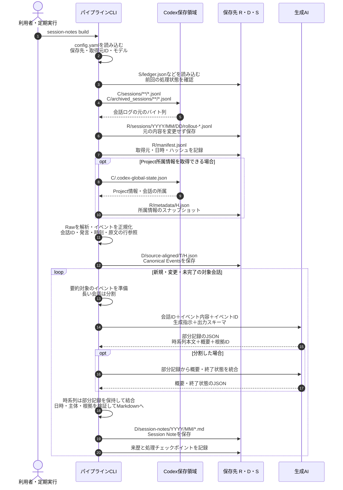

# Tkn Codex Chat Note Pipeline

English: [README.md](README.md)

Codexとの会話を源泉データとして保存し、会話ごとに再利用可能なSession Noteを生成する
ローカルCLIです。依頼、訂正、失敗した試行、未解決の問い、根拠付きの時系列、
最後に確認できた状態を残し、後から異なる観点で考え直せるようにします。

**session** は時系列で連続した一連の会話を意味し、そのまとまりを一つのMarkdownノートに記録します。

処理はSession Noteで完了します。分類とWorking Contextは
[tkn_genai_context_curation_pipeline](https://github.com/tuckn/tkn_genai_context_curation_pipeline)、
Decision抽出は
[tkn_genai_insight_pipeline](https://github.com/tuckn/tkn_genai_insight_pipeline)の責務です。
各CLIは単独でインストールでき、バージョンを持つファイルで連携します。

## 使い方 — 最初の結果まで

### 必要なものとインストール

Python 3.11以上、uv、読み取り可能なローカルCodex JSONLログを用意します。
生成には設定済みの推論プロバイダーが必要です。既定はCodex CLIで、
Claude Code、GitHub Copilot CLI、ローカルOllamaも推論に利用できます。
**チャット取得はCodex専用です。**
推論プロバイダーは独立して選択でき、他アプリのチャット取得は本リポジトリの対象外です。

~~~console
cd "C:\path\to\tkn_codex_chat_note_pipeline"
uv tool install .
tkn-codex-chat-note --help
tkn-codex-chat-note config init
~~~

表示された`~/.tkn/codex_chat_note_pipeline/config.yaml`を編集し、保存先と
利用可能なモデルを指定します。Codexを使う場合は、端末で`codex --version`と
`codex login status`を確認します。デスクトップアプリだけではCLIの代わりになりません。
[同梱設定例](src/tkn_codex_chat_note/resources/config.example.yaml)も参照してください。

### 最初の保存・生成

~~~console
tkn-codex-chat-note config show
tkn-codex-chat-note clone --dry-run
tkn-codex-chat-note clone
~~~

`clone`は未作成の管理領域を初期化し、取得できる全履歴を保存・正規化して、
対象のSession Noteを生成します。通常実行は書き込みを行い、履歴量に応じて
推論時間・トークンを消費します。

`--dry-run`はローカル入力を読み、実行条件と予定を検証します。
推論・ネットワークアクセスは行わず、ディレクトリ、ロック、cache、reportも作りません。

### 日常の更新と結果確認

~~~console
tkn-codex-chat-note pull
tkn-codex-chat-note status
tkn-codex-chat-note provenance validate
~~~

`pull`は追加・変更されたログを取得し、対象ノートの更新と未完了処理の再開を行います。
成功済みで入力条件が変わらなければ、モデルを再呼び出ししません。
既定の待機時間は30分です。活動中の会話の要約を延期しても、その前にRawを保存します。
`--limit 20`で1回の生成試行数を制限できます。

`clone` / `pull`は`Ctrl+C`で中断できます。保存済みのRawと生成完了したノートは残り、
次回の`pull`では入力・生成設定・ノートに変更のない成功済みノートをスキップします。
検証済みのチャンクと統合結果はcacheへ途中保存します。同じ入力・生成条件で再実行すると、
保存済み部分を再利用し、中断時に生成中だった未保存部分からやり直します。
入力・モデル・prompt・分割条件が変わった場合や`--force`時は再利用しません。
破損した途中結果は該当部分を再生成します。cacheを削除すると途中結果は再利用できなくなります。
中断時は`KeyboardInterrupt`が表示され、実行レポートが完了状態にならないことがあります。

結果に表示されたノートとreportのパスを開いて確認します。
`status`は前回実行時の記録であり、現在の入力を再走査しません。
完了判定は対象Session Noteだけで行い、Scope・Decision・Working Contextの生成を待ちません。

### 生成コストと比較用ノート

同じ実行ID・turn・履歴の完了記録と実行結果で本文が一致する場合、推論入力の重複本文を
元イベント参照へ置き換えます。全イベントID・完了metadata・Raw・Canonical Eventsは保持し、
実際の再試行や内容が異なる出力は省略しません。AIはタイムラインの起点を1イベントで指定し、
日時・話者・公開ノートの両端点はプログラムが確定します。内容と出典の検証は継続します。

reportの各threadの`generationMetrics`には、入力削減文字数・チャンク数・モデル呼び出し数・
修正数・途中結果再利用数・処理時間を記録します。`submittedPromptCharacters`は修正・通信再試行を
含む送信promptの文字数で、providerが加えるschema等や課金token数を表しません。

0.17.0は生成条件を更新するため、旧条件の未reviewノートは次回の通常実行で再生成対象になります。
比較に残すノートは、導入・実行前にノート本体とprovenanceの元入力snapshot・hash・生成条件を
別の評価領域へ固定してください。現在のRawパスは更新され得ます。比較は同じ元入力版で行い、
既存ノートを正解扱いせず原文に照らして評価します。review済み・手編集ノートの保護は継続します。

### Windows Task Schedulerでの週次更新

初回の`clone`後、普段CLIにログインしている同じWindowsユーザーで、週1回の`pull`を登録します。
プログラムにはインストール済み`tkn-codex-chat-note.exe`の絶対パス、引数には
`--config "C:\path\to\config.yaml" pull`を指定します。設定オプションは`pull`の前に置きます。
開始フォルダに`.tkn/config.yaml`があると設定階層に加わるため、通常実行で使う設定と一致させてください。
WSLの取得元を有効にした場合、そのユーザーから設定したUNCパスを読める必要があります。

未生成のノートは次の`pull`で再開します。`--limit`を付けた検証や、活動中の会話・実行時間上限による
延期が残る実行は終了コード`2`になります。終了コード`1`はreportの失敗理由を確認します。
`runtime_minutes`は新しい生成を開始する期限で、実行中の生成には最大9分の猶予があります。
Raw取得・正規化はこの生成期限によって中断されません。Task Scheduler側の停止時間には余裕を持たせます。

## コマンド一覧

`--config`や推論設定などの共通オプションは、コマンドの前に置きます。

| コマンド | 動作 |
| --- | --- |
| `config init` | 同梱設定を作成。編集済み設定は保護し、`--force`時はバックアップ後に置換 |
| `config show` | 有効な設定、5段階の設定元、要約プロファイルのhashを表示 |
| `clone` | 初期化と全履歴の保存・生成。再実行で再開可能 |
| `pull` | 初期化済みの保存先へ差分を反映し、ノート生成を再開 |
| `raw ingest` | 推論せずに元のバイト列を保存 |
| `session-notes build` | ノートを更新。`--thread-id`で会話を選択 |
| `session-notes validate <artifact>` | ノートの読み取り専用検証 |
| `status` | 前回の対象範囲・状態・reportパスを表示 |
| `provenance validate` | hash、ID、来歴の関係を読み取り専用で検証 |
| `storage migrate` | `--from-config`で指定した取得元を新しいrootへコピー。`--dry-run`で内容を確認 |

生成コマンドでは`--dry-run`、`--force`、`--allow-edited`、`--full-output`を使えます。
`--force`は入力が同じでも再評価しますが、review済みファイルの保護は解除しません。
`--allow-edited`は手編集した未reviewノートの置換を明示的に許可します。
Raw取得は`--dry-run`と`--full-output`に対応します。

進捗は標準エラー、結果は標準出力のJSONです。`-q`は進捗を抑制し、`-v`は診断を追加します。
終了コードは、成功・計画検証が`0`、失敗が`1`、clone/pullの未完了が`2`です。
単独ノートのbuildでも、reportにはノート全体の処理状況が含まれます。

## 設定の詳細

優先順位は、組み込み既定値 → ユーザー設定 → 現在のフォルダの`.tkn/config.yaml` →
明示した`--config` → CLIオプションです。各設定ファイルを統合前に検証します。
相対パスはその値を宣言した設定ファイルの場所から解決します。
設定スキーマ7.0.0はsnake_caseのキーと引用したSemVerを使い、
未知のキーや未対応の新しいバージョンはエラーにします。

~~~console
tkn-codex-chat-note --config "C:\path\to\config.yaml" clone
tkn-codex-chat-note --idle-minutes 0 --runtime-minutes 60 pull --limit 20
~~~

### 保存先フォルダ

未指定の場合、各種データは `~/.tkn/codex_chat_note_pipeline/<kind>/codex/<source_id>`に保存されます。
保存先フォルダを変更する場合、`config.yaml`の各`sources.<source_id>`で`raw_root`・`data_root`・`state_root`を設定します。
なお、`cache_root`は共通で使用され、取得元ごとには設定できません。

```yaml
schema_version: "8.0.0"
cache_root: ~/.cache/codex_chat_note_pipeline
sources:
  my-windows-pc:
    enabled: true
    source_root: ~/.codex
    include_archived: true
    raw_root: C:/path/to/my-chat-store/raw
    data_root: C:/path/to/my-chat-store/data
    state_root: C:/path/to/my-chat-store/state
  my-wsl-ubuntu:
    enabled: false
    source_root: '//wsl$/Ubuntu/home/<user>/.codex'
    include_archived: true
```

実際の各rootは互いに分離し、取得元source_rootや設定ファイルとも重ならない場所にします。
共通の親の下に`raw/`・`data/`・`state/`を並べると、まとめてバックアップ・移動できます。
stateは再開・checkpointのための永続データとして保持し、dataとセットで管理します。
公開する証跡はdata内のprovenanceに保持します。cacheは再作成できるため移行ではコピーしません。
アプリのProject情報がなくても会話を保存できます。

推論の接続設定・認証は[推論プロバイダー](#inference-configuration)を参照してください。
外部CLIによる生成では、選択した入力がそのサービスへ送られる場合があります。
Ollamaの接続先はループバックに限定します。利用可能なモデルと認証はプロバイダー側の管理です。


### Session Noteの言語

既存の`config.yaml`の`generation.session_note_profile`で、`default-jp`（日本語・既定）または`default-en`（英語）を選択します。以下は設定の抜粋です。他の設定は維持してください。

```yaml
generation:
  session_note_profile: default-jp
```

1回だけ切り替える場合は、`tkn-codex-chat-note --session-note-profile default-en pull`を使います。オプションはコマンドの前に指定します。`config show`に選択したprofile、リソースとhash、設定元を表示します。

両profileのschema・見出し・時系列・引用・状態判定は共通です。本文の言語と説明文だけを切り替え、時刻はAsia/Tokyoを維持します。カスタムprofile名・フォルダ・promptの指定には対応しません。組み込みリソースは`profiles/default-jp/`と`profiles/default-en/`に配置しています。

言語を変更すると、次のbuild/pullで既存ノートが再生成の対象になります。1会話につき1ノートとそのIDを維持するため、言語別のノートは併存しません。レビュー済み・編集済みノートの保護は維持し、dry-runでは生成も書き込みも行いません。異なるprofileの途中生成結果は再利用しません。

### Chat取得元と生成AI

`sources`はローカルCodexの取得元、`generation.profiles`はノート生成に使うAIの設定です。
`--profile`は`generation.active_profile`だけを切り替え、取得元を変更しません。
Claude Code・Copilot・Ollamaは推論の選択肢として維持し、それらのチャット取得は対象外です。

トップレベルの`sources`マップのキーが`source_id`です。値の中に`source_id`は重複して書きません。
各取得元に`enabled`（既定`true`）・`source_root`（既定`~/.codex`）・
`include_archived`（既定`true`）と、任意の最終保存先`raw_root`・`data_root`・`state_root`を指定します。
`source_root`は`sessions/`ではなく親の`.codex`を指し、sessions・archives・アプリの補助情報を読み取ります。
Codex自身の保存先・認証や生成AIの設定は変更しません。

IDは、継続して取得する入力フォルダを識別できる名前にします。例は`laptop-windows`、
`laptop-wsl-ubuntu`です。**半角英小文字のkebab-caseを推奨**します。Pythonの変数名ではなく、
設定キー・フォルダ名・来歴の識別子として使います。制約は次のとおりです。

- 半角英字（大文字も可）・数字・`.`・`_`・`-`を使用し、先頭は英数字にします。
- 空白、日本語・全角文字、前後の空白、末尾のドットは使えません。
- `CON`・`nul.txt`・`COM1`など、Windowsの予約名は使えません。
- sources全体で大文字・小文字だけが異なるIDも重複として拒否します。
  大文字小文字や空白の自動変換はしません。数字だけのYAMLキーは引用符で囲みます。

出典・後続ツールとの互換性のため、公開データの識別単位は`(codex, source_id)`を維持します。
取り込み開始後は固定してください。キーを変更しても既存データの改名・移行は行われません。
`source_root`や保存先フォルダのパスには、従来どおり空白・日本語を使えます。
同じ入力フォルダを複数IDで登録しないでください。

有効なCodex取得元をマップの順番で処理します。`--limit`は失敗した生成やdry-runの計画も含む
1回の実行全体の生成試行数、`runtime_minutes`は全取得元で共有する生成期限です。
書き込み前に選択された全保存領域を検証し、catalog・provenance・checkpoint・実行レポートは
取得元ごとに保持します。処理中の取得元の失敗は全体の失敗結果に含め、他の取得元は続行できます。
通常の出力は取得元ごとの集計とレポートのパス、`--full-output`は各会話の詳細も含みます。

~~~console
tkn-codex-chat-note clone --dry-run
tkn-codex-chat-note --source my-windows-pc pull
tkn-codex-chat-note --source my-windows-pc session-notes build --thread-id <thread-id>
tkn-codex-chat-note status
tkn-codex-chat-note provenance validate
~~~

`--source`はコマンドの前に指定し、処理・status・provenance検証・storage移行の取得元を選びます。
省略時の処理・status・provenance検証は有効な全取得元が対象です。複数が有効な場合、
`--thread-id`とstorage移行では1取得元を選択してください。不明なIDや無効な取得元の指定は
エラーになります。`config show`は常に全取得元の設定と解決済み保存先を表示します。

設定の階層間ではマップのIDごとに統合し、同じIDの指定フィールドだけを上書きします。
明示したマップが組み込みの取得元に置き換わるため、独自のIDを追加しても既定の`windows`が
余分に有効になることはありません。`sources: {}`で取得元マップ全体を空にでき、
`enabled: false`で継承した1取得元を無効にできます。YAMLキーの重複も拒否します。

無効な取得元は走査せず、その入力フォルダは存在しなくても構いません。
有効な取得元がない場合は書き込み前に実行を止めます。`config show`は使用できます。
廃止した`chat`や取得providerの階層を含む設定は拒否します。

WindowsとWSLの入力フォルダには別のIDを付けます。Windows側では、ディストリビューションへ
アクセスできる状態で上記のWSL UNCパスを利用できます。WSL内で本CLIを実行する場合は、
Linux側のパスと生成用の実行ファイルを設定してください。`~`は本CLIを実行するOSに従います。
WSLの例は設定方法を示したもので、WSLとの実動作確認は未実施です。アカウント別フィルタは実装していません。

<a id="inference-configuration"></a>

### 推論プロバイダー

`generation.profiles`のキーは任意の設定名です。各設定の`provider`に
`codex`・`claude-code`・`github-copilot`・`ollama`・`azure-openai`を明示します。
名前・実行ファイル・URLから実行方式を推測しません。`executable`はCLIの実行ファイル名・パス、
`endpoint`はHTTPの接続先です。Azureの`authentication`・`pricing`・`limits`も`model`と同じ階層に置き、
`azure`の入れ子は使いません。実行ファイルの既定値はcodex/claude/copilot、Ollamaの接続先は
http://127.0.0.1:11434です。

同じproviderで`azure-high`・`azure-low`など複数の設定を持てます。
`tkn-codex-chat-note --profile azure-high pull --dry-run`で選択します。
`--model`・`--reasoning-effort`は、選択中のプロファイルだけをその実行中に上書きします。
旧`--provider`は候補が一意の場合に選択でき、複数なら`--profile`の指定が必要です。
候補がないCLI/Ollamaは従来どおり`--model`と併用して一時設定を作れます。
プロファイル名がprovider名と一致していても、名前から実行方式は判断しません。
`--profile`と本文言語の`--session-note-profile`は別の設定です。

旧schema 7.0–7.2は各設定層を統合する前にメモリ内で変換します。
`active_provider`を`active_profile`へ、`providers`を`profiles`へ移し、旧キーを`provider`に設定します。
`base_url`は`endpoint`へ、旧`azure`内の項目は`model`と同じ階層へ移します。
任意のtenantは`authentication.tenant_id`へ移します。読み込みではファイルを変更せず、
`config show`で変換後の値・由来・移行状態を確認できます。
最初の新形式のprofilesマップは組み込みのプロファイル名を置き換え、以後の設定層は名前で統合します。
同じ名前でproviderを変更するときは新しいモデル・接続設定が必要で、以前の接続情報は引き継ぎません。
同じ設定層で新旧キーを混在させるとエラーになります。保存先・認証cache・ノートIDは変わりません。
プロファイル名だけの変更では途中結果を無効化しません。実行レポートと来歴には、
provider・modelとは別に`generationProfile`を記録します。


取得対象は、ローカルに保存されたCodexの会話ログです。
推論に使用する生成AIモデルは、`generation.active_profile` と各プロバイダーの `model` で変更できます。
選択するプロバイダーのモデルと接続先を指定してください。モデルの利用可否と認証は各サービス側で管理します。

| プロバイダーID | 接続設定 | 実行方法 |
| --- | --- | --- |
| `codex` | `executable: codex` | 独立した `codex exec` |
| `claude-code` | `executable: claude` | 非対話のClaude Code |
| `github-copilot` | `executable: copilot` | 非対話のCopilot CLI |
| `ollama` | `endpoint: http://127.0.0.1:11434` | ローカルのchatエンドポイント。ループバックのみ |

利用可能なローカルモデルを使う場合は、例えばgenerationブロックを次のように置き換えます。

```yaml
generation:
  active_profile: local-gemma
  profiles:
    local-gemma:
      provider: ollama
      model: <installed-local-model>
      reasoning_effort: high
      endpoint: http://127.0.0.1:11434
```

CLI型のプロバイダーでは、選択した生成入力をそのCLIの設定先サービスへ送信します。
Rawと来歴のスナップショットには元の内容がローカルに残るため、会話データに適した保存先を選びます。
生成プロファイル、出力検証、再試行上限はアプリケーションが管理します。
モデル、プロバイダー、推論設定、ノートの言語プロファイルを変更すると、関連する段階が再生成対象になります。

### 既存データを引き継がず再構築する場合

新しい設定ファイルを作り、空の`raw_root`・`data_root`・`state_root`を指定して
「最初の保存・生成」の手順を実行します。再構築できる範囲は取得元に残る会話ログです。
別の保存領域に作り直すため、旧ノートのID・手編集・レビュー状態は引き継ぎません。

~~~console
tkn-codex-chat-note --config "C:\path\to\rebuild.yaml" config init
~~~

作成した設定を編集し、その後の`config show`・`clone`にも同じ`--config`を指定します。
旧ユーザー設定の検出で既定の`config init`が停止する場合も、上記のように新規設定の
保存先を明示できます。ただし、読み込まれる現行のユーザー設定や`.tkn/config.yaml`も
設定schema 8または変換対応済みの7.0–7.2である必要があります。`--config`は下位の設定の検証を省略しません。

## Azure APIとOllamaの入力・費用制御

0.21.1ではconfig schema 8.0.0を使います。Azure CLIは不要です。
音声文字起こしCLIと同じSDKのブラウザ認証・永続cache方式です。まず保存済みの認証でtokenを取得し、
対話が必要な場合だけブラウザを開きます。認証後はアカウント情報と暗号化cacheを次回にも使います。
認証の取消・組織の方針変更などでは再認証が必要です。対話認証にはブラウザとローカルの接続先が必要です。
取消・タイムアウト時は推論送信前に停止します。ただし`pull`の履歴取り込みは先に進んでいる場合があります。
dry-runは認証せず、ブラウザも開きません。

アカウント記録は`~/.tkn/codex_chat_note_pipeline/authentication/`へ保存します。access/refresh tokenは
SDKの暗号化cacheに保存し、平文保存には切り替えません。cache名は本アプリ・endpoint・任意tenantで分離し、
他アプリやAzure CLIの認証をコピー・変更しません。アカウントを選び直す場合は実行を終了し、
本アプリの該当アカウント記録だけを削除すると、次回生成時にブラウザで選択できます。

最小のAzure設定は次の通りです。`generation.profiles`配下へ置き、
`generation.active_profile: azure-high`を指定します。

```yaml
azure-high:
  provider: azure-openai
  model: <deployment-name>
  reasoning_effort: high
  endpoint: https://<resource>.openai.azure.com/openai/v1/
```

Azureの`model`は呼び出すdeployment名です。実モデル名を別途設定する必要はありません。
`deployment`・`model_version`・`subscription_id`は指定しません。tenantを明示する必要がある環境では
`authentication.tenant_id`を任意で指定できます。実モデル名と版を含む識別子はAPI応答から記録し、版を推測しません。
ノートの`generatorModel`は実応答モデル、`generatorDeployment`は要求deploymentです。
provenanceも`model`と`requestedDeployment`を分けて記録します。

金額表示が必要な場合だけ、`model`・`endpoint`と同じ階層にdeployment別の`pricing`を追加します。
`--model`等でdeploymentを変えても、別deploymentの単価は流用しません。
一致する単価がなければtokenの見積もり・実績を表示し、料金は不明、**JPY上限は適用しない**と表示します。
入力・出力・呼び出し回数の上限は引き続き適用します。

```yaml
pricing:
  <deployment-name>:
    input_jpy_per_million: 100.0  # 仮の値。適用される確認済み単価へ置き換える。
    output_jpy_per_million: 500.0
    pricing_date: YYYY-MM-DD
```

`limits`も省略できます。既定値は入力60,000／出力16,000／context100,000 token、
分割120,000文字、30呼び出し、単価がある場合の確保額上限100円です。
すべてのdeploymentの対応能力を表す値ではありません。単価は利用者設定による概算で、Azureの請求情報を
自動取得するものではありません。同じdeployment内でモデルを更新した場合も、適用単価を見直します。

旧schema 7.0/7.1のAzure設定はメモリ内で変換します。`azure.deployment`を`model`へ移し、
実モデル名・版・subscriptionの必須指定を除き、旧単価をdeployment別のpricingへ移します。
設定ファイルは自動で書き換えません。明示的に設定を更新し、`config show`で有効な値を確認できます。

v1 Chat Completionsへ厳密なJSON形式、`store=false`、推論分を含む回答上限とdeployment名を渡します。
返答には実モデルの識別子が必要です。途中結果にも識別子を保存し、後の応答・途中結果と異なる場合は
異なるモデルの生成結果を混ぜず停止します。同じdeployment内のモデル変更後は`--force`で再生成してください。
全てcacheから再利用できる場合や既存ノートが最新の場合はAzureへ接続しないため、サーバー側の変更を検知できません。
endpoint・deployment・設定の変更では生成条件が変わり、以前の途中結果を再利用しません。

API非対応のschema制約は送信形式からのみ除き、ローカルでは引き続き検証します。
拒否・回答打ち切り・401/403は通信再試行せず失敗にします。429と一時的なサーバー／通信エラーは最大3試行とし、
Retry-Afterの秒数・日時・ミリ秒指定を尊重します。待機指定が60秒を超える場合は、指定時間後の再開を案内して停止します。
生成内容の修正呼び出しも予算に含めます。

Ollamaはprovider内に `limits` と固定した `model_digest` を設定できます。
`context_tokens` と `output_tokens` を `num_ctx` と `num_predict` へ渡します。
例えば入力48000・出力8192・context65536で実験を始められますが、これは試行条件であり、
PC性能に対する推奨値ではありません。tokenizerに依存しないUTF-8 byte数の上限を使うため、
多くの小さな分割になる場合があります。`limits` を省略した場合は従来のOllama動作を維持します。

分割・統合・修正のすべてで、指示文とschema込みの入力を送信前に確認します。
Azureの見積もりは検証済みのローカル `o200k_base` cacheと余裕分を使い、利用できなければ
byte数の上限を使います。請求token数ではありません。分割は枠に収まるまで自動調整します。
統合・修正が枠を超える場合は、保存済み分割を残して停止します。適切な上限への調整、または
統合方式の変更後に再開してください。dry-runでは認証用token取得・認証・AI呼び出しを行いません。

予算は1つの生成runner／コマンドに適用し、選択した取得元間でも共有して、順番に呼び出します。送信するたびに推定入力と
最大出力の費用を確保し、課金結果が不明な失敗時も確保分を残します。確保額は請求額や返金額ではありません。
別コマンド・別プロセスでは予算が新しくなるため、複数実行を合算した上限ではありません。
Azureの費用通知も課金を停止しません。適用される最新の単価を設定し、1プロセスで実行して、
評価を再開するときは過去の試行分も含めて残り予算を管理してください。

run reportの `generationMetrics.apiRequests` に、取得できた実入力・出力・推論・cached input token数、
応答model、時間、推定JPY費用を保存します。未知のusageはnullです。cached inputは通常入力単価で
保守的に計算し、cache writeは報告されない限り不明とします。接続先・deployment・設定・上限・digestは
生成条件のfingerprintとprovenanceへ反映します。実応答モデルは呼び出し記録・検証済み途中結果へ別途保存します。

実データ保存領域と分けた比較には `scripts/evaluate_session_notes.py --manifest <private-baseline-manifest.json>
--config <generation-config.yaml> --output <fresh-evaluation-directory> --thread <thread-id>` を使えます。
`--dry-run` は計画の検証だけを行います。snapshotのhashを検証し、検証済みMarkdown・構造化JSON・
各試行の使用量を `run-history` に保存し、再開前の費用記録も残します。同一条件の再実行では完了済み出力と途中結果を再利用します。
出力先には評価専用のディレクトリを指定してください。manifestの各行には `metadata`、元のprovenanceの
`activity` と、SHA-256をファイル名にした複製を指す `files.sessionNote` / `raw` / `canonicalEvents` を持たせます。

実装上の参照: [Azure構造化出力](https://learn.microsoft.com/en-us/azure/foundry/openai/how-to/structured-outputs)、
[ブラウザ認証](https://learn.microsoft.com/en-us/python/api/azure-identity/azure.identity.interactivebrowsercredential)、
[Ollama chat API](https://docs.ollama.com/api/chat)。

API送信時は構造化された出典IDだけを短い可逆な別名へ変換し、全出典を共通のJSON Schema enumから
選ばせます。返答を元のIDへ戻してから検証し、原文の本文・Raw・Canonical Eventsは変更しません。
長いIDの反復入力を減らし、IDの省略・捏造を防ぎます。統合の修正には、Rawを再送せず許可されたIDを
添えます。送信形式は `apiRequests` の `event-id-aliases-v1` で識別できます。

### 入力量・費用の事前確認と実測ログ（0.19.0）

```console
tkn-codex-chat-note clone --dry-run
tkn-codex-chat-note pull --dry-run --limit 1
tkn-codex-chat-note pull --limit 1
```

dry-runは、選択したうち生成が必要なノートを見積もります。最新・レビュー済み・編集保護対象・
延期したノートを生成費用に含めません。検証済みの分割cacheを読み、再利用分を除外します。
最終統合の入力はまだ未確定なので、統合や保存待ちノートを後で再利用できる場合も統合1回を
確保します。ファイル作成・認証・通信は行いません。`--full-output`で会話ごとの
`generationEstimate`も表示し、既定のJSON出力には集計を残します。

全方式で本文文字数、未処理のプロンプト文字数、基本呼び出し数を表示します。
Codex等のコマンド方式は、内部で追加される文脈・schema・課金情報を把握できないため、token数・
金額は不明とします。Azureではさらに**全呼び出しの入力合計token見積もり**、推論込みの
出力token上限、**基本処理の概算費用上限（JPY）**を表示します。1回の入力上限とは別の値です。
未確定の統合入力には設定上限を、各回答には最大出力を確保します。修正・通信再試行は別枠です。
予想請求額や全件完了の保証ではありません。コマンド全体の回数・費用上限と、見積もりがその
上限を超える可能性も別に表示します。

Azureは既存の`o200k_base` tokenizer cacheをSHA-256検証して読み、余裕を加えます。
利用できない場合は保守的なUTF-8 byte数の上限を使い、`utf8-byte-upper-bound`と記録します。
見積もりのためにcacheをダウンロード・修復することはありません。上限付きOllamaもbyte数を
使うため、分割数が多めになる場合があります。

実行中はstderrに、各呼び出しの入力見積もり・確保額、応答の実入力／出力token数・概算JPY費用、
会話・全体の集計を表示します。未知のusageやローカルの費用を0として表示しません。
Codexの呼び出しではプロンプト文字数を表示します。通常のrun reportには次を保存します。

- `threads[].generationEstimate`: 生成前の前提・上限付き見積もり。
- `threads[].generationMetrics.apiRequests[]`: 呼び出し番号、分割／統合／修正の区別、
  実usage、時間、応答model、確保額・概算費用。失敗した試行も含む。
- `threads[].generationMetrics.usageTotals`と全体の`usageTotals`: 合計、
  `knownInputTokens`・`knownEstimatedCostJpy`などの既知分小計、未取得の呼び出し数。

統合の修正時は部分要約の本文・根拠を維持し、重複する出典ID一覧とJSONの装飾用空白を省きます。
文字列の中の空白や事実は変更しません。

未取得のusageがある合計はnullとし、既知分の小計を別に残します。run reportは取得元ごとの
`<state_root>/reports/`に固有のrun IDで保存され、`reportPath`／`reportPaths`から確認できます。
失敗後の再開も含めた分析は、固有run reportを合算してください。`last-run.json`やstdoutの
複製も合算すると二重計上になります。dry-run自身はレポートを保存しないので、計画を残す場合は
stdoutをファイルへリダイレクトしてください。

### 見積もり・使用実績・予算停止の読み方

12分割のノートの`13 base calls`は、分割要約12回＋統合1回です。
`output ceiling 208,000 tokens`は、基本13回×出力上限16,000 tokenを表します。
`base cost ceiling JPY 53.64 (repairs/retries extra)`は、その基本処理の推定入力と最大出力で
計算した上限寄りの概算です。予想請求額ではなく、内容修正・通信再試行の分は別途です。
完了時の`16 model calls, 3 semantic retries, ... estimated JPY 28.69`は、分割12回＋統合1回＋
内容修正3回、計16回の送信分を含みます。token数はAPI応答の実績、円額は設定単価での計算です。
Azureの確定請求額を取得した値ではありません。入力410,889／出力81,574 token、100万token当たり
入力31.864／出力191.184円なら、概算28.688210712円です。単価・数値は読み方を示す例です。

`command reserve`は、以前のノートや他の選択取得元も含めた、このコマンド全体の確保額です。
各呼び出しの推定入力＋最大出力の費用を積み上げ、現在の実装では回答が短くても確保額を戻しません。
そのため、使用実績に基づく概算が100円未満でも、既定の確保額上限100円で停止することがあります。
`no request submitted`の呼び出しは未送信で、その呼び出しによる課金はありません。
それ以前に送信した分の使用量・費用は残ります。

0.21.0以前では、このコマンド単位の停止を各会話の失敗として扱い、同じエラーを繰り返していました。
0.21.1以降は、最初の費用・回数上限による拒否で以後の生成を停止し、未完了分を`deferred`（保留）にします。
警告は1回だけ表示し、後続の見積もり・生成は行いません。既に最新のノートやレビュー保護は通常の状態を維持し、
取得元の取り込みや最終レポートの保存は完了処理として続く場合があります。停止は選択した全取得元で共有します。
レポートの`generationStop`には理由・確保額・回数・上限を残し、保留理由は`api-cost-budget`または
`api-call-budget`になります。他の失敗がなければ終了コード2（未完了）です。
残額によっては小さな後続呼び出しが入る可能性はありますが、全件を試す代わりに最初の予算拒否で停止します。

再開は、同じプロファイル・設定のまま、`--force`を付けずに実行します。

```console
tkn-codex-chat-note --profile azure-high pull --dry-run --limit 1
tkn-codex-chat-note --profile azure-high pull --limit 1
```

完了済みで変更のないノートはスキップし、検証済みの分割は再利用します。新しいコマンドには新しい予算枠が
適用され、追加送信には追加費用が発生します。`--limit 1`は生成を試すノート数の上限で、API回数・金額の上限ではありません。
36分割＋統合の会話も、30回の呼び出し上限の中で複数コマンドに分けて進められます。
再利用には入力・生成設定が同じでcacheが正常であることが必要です。未送信の分割自体は保存されていません。
必要な1回の呼び出しすら新しい予算枠に収まらない場合は、同じ再実行だけでは解消しません。
その場合はプロファイルの`limits.max_cost_jpy`・`limits.max_calls`を見直します。費用上限だけ増やしても回数上限は残ります。
現仕様では上限値も生成条件の識別に含まれるため、変更すると既存の途中結果が再利用対象外になり、
完了済みの未レビュー生成ノートも再生成対象になり得ます。まず同じ設定での再開を推奨し、通常の予算停止では
`--force`を使いません。アプリケーションが設定上限を自動で増額することはありません。

### 最終統合で未確認事項を保持する

生成プロンプト10、日本語3.8、英語1.4では、各分割の未解決・未確認事項をすべて判定対象とし、
残す項目は元の文面を最終状態に追加します。除外には、同じ履歴の後続イベントと理由が必要です。
未処理・重複・不正な判定は上限付きの修正対象にします。判定は内部記録の
`generationMetrics.stateItemReviews`に残し、公開Session Note schema 6は維持します。
出典が本当に解決を示すかはモデルが判断するため、事実確認が不要になるわけではありません。
最新の依頼が完了しても、以前の未確認事項を自動的に空にしません。
統合入力ではタイムラインの冗長な開始／終了IDだけを省き、本文・出典は保持します。
公開タイムラインは維持し、統合の修正には必要な状態情報を渡します。
プロンプト更新により全providerの旧生成条件・途中結果は再生成対象になりますが、
レビュー済み・編集済みノートの保護は維持します。既存Ollama設定も引き続き利用できます。

## 保存構造と責務の境界

~~~mermaid
flowchart LR
    L["ローカルCodexログ"] --> R["Rawコピーとmanifest"]
    R --> E["Canonical Events"]
    E --> T["Session Note"]
    M["観測したProject所属"] --> C["会話catalog"]
    T --> C
    C --> U["Context分類CLI<br/>（別リポジトリ）"]
    T --> I["洞察CLI<br/>（別リポジトリ）"]
    R --> P["バージョン付き根拠"]
    E --> P
    T --> P
~~~

省略時の保存先は「領域の役割 → 取得元アプリ → 取得環境 → データの種類」の順です。
明示したrootでは、その直下からデータの種類を配置します。
以下の`P`は取得provider（`codex`固定）、`I`はsource_id、`T`はthreadKey、`H`は内容hashです。
`generation.active_profile`を変更しても保存先は変わりません。

| 保存パス | 内容 |
| --- | --- |
| `<raw_root>/sessions/...` | Codex元ログの相対構造とバイト列を保持した最新コピー |
| `<raw_root>/archived_sessions/...` | Codex側のアーカイブ構造を保持した最新コピー |
| `<raw_root>/manifest.jsonl` | 取得元・参照・hashを記録するRaw manifest |
| `<raw_root>/metadata/H.json` | 観測したアプリのProject情報 |
| --- | --- |
| `<data_root>/source-aligned/T/H.json` | 元ログの参照位置を持つCanonical Events |
| `<data_root>/session-notes/YYYY/MM/...md` | 会話開始年月で分けた現在のSession Note |
| `<data_root>/catalog/threads.json` | この取得元の会話・所属・状態・ノート参照をまとめたcatalog |
| `<data_root>/provenance/...` | この取得元の不変snapshot・entity・activity・公開index |
| --- | --- |
| `<state_root>/pipeline.json` | 取得元ごとの初期化情報・storageバージョン |
| `<state_root>/threads/T/...` | 会話単位の内部checkpoint |
| `<state_root>/ledger.json`・`reports/`・`last-run.json`・`normalization/` | 取得元ごとの実行・正規化状態 |
| --- | --- |
| `<cache_root>/P/I/...` | 取得元ごとの再利用可能な生成作業cache |

例えば、providerが`codex`、source_idが`my-windows-pc`なら、Rawは
`~/.tkn/codex_chat_note_pipeline/raw/codex/my-windows-pc/sessions/...`、
ノートは`~/.tkn/codex_chat_note_pipeline/data/codex/my-windows-pc/session-notes/YYYY/MM/...md`です。
互換性のため、保存先の`codex`という区分は維持します。
`config show`の`storage.sourceRoots.<source_id>`で各取得元の最終保存先を確認できます。

各rootに取得元IDを含む所有権markerとロックを置き、異なる取得元への流用を拒否します。
`status`と`provenance validate`は設定した1取得元を対象にします。同じ会話のthreadKeyが
別環境にもあっても、ノートID・checkpoint・catalog・provenanceは独立します。
`data:/`はこの取得元のdata_rootを基点にします。`raw:/codex/<source_id>/`は論理的な
取得元識別prefixであり、その後ろの部分をこの取得元のraw_rootに連結します。
`store.json`は取得元のIDと旧参照の対応を保持する付属ファイルです。

<a id="processing-flow"></a>

### session-notes build：RawからSession Noteを生成

会話ログをRawとして保存・正規化し、対象会話のSession NoteをMarkdownで生成します。
`--thread-id` で1会話を選べます。DecisionとWorking Contextは、このコマンドでは生成しません。
AIにはイベント内容・ID、生成指示、出力スキーマを渡します。

以下は `tkn-codex-chat-note session-notes build` の処理です。表の略記は直後の図で使います。

| 図中の表記 | 設定項目 | 既定の保存先 |
| --- | --- | --- |
| `C` | `sources.<source_id>.source_root` | `~/.codex` |
| `R` | `sources.<source_id>.raw_root` | `~/.tkn/codex_chat_note_pipeline/raw/codex/windows` |
| `D` | `sources.<source_id>.data_root` | `~/.tkn/codex_chat_note_pipeline/data/codex/windows` |
| `S` | `sources.<source_id>.state_root` | `~/.tkn/codex_chat_note_pipeline/state/codex/windows` |

`T` は会話の `threadKey`、`H` は内容のハッシュです。
図のパスでは、それぞれの実際の値を表すプレースホルダーとして使います。



保存するCanonical Eventsと要約処理が使うイベントは、同じ解析結果に基づきます。
現在の実装は、保存した正規化JSONを再読込せず、メモリー上のイベントを要約処理へ渡します。
この段階の要約単位は会話であり、作業scopeによる統合とは独立しています。

### 保存先の変更

現行形式の保存領域を別フォルダへ移す場合は、`storage migrate`を使います。
Raw・Session Note・正規化データ・来歴・再開状態をコピーし、ノートのIDと内容、
レビュー状態を保持します。推論は行わず、保存先の変更だけでは再生成しません。

1. 移動元の最終保存先と取得元IDを単独で解決できる設定ファイルを用意します。
   `--from-config`の設定には、他の設定階層の値は統合されません。
2. 同じ取得元IDを持つ設定を別ファイルに用意し、`raw_root`・`data_root`・`state_root`を
   移動元と重ならない新しい最終保存先にします。複数の取得元が有効なら`--source`で1つ選びます。
3. コピー中は移動元への書き込みを停止し、以下の順に確認・実行します。

~~~console
tkn-codex-chat-note --config "C:\path\to\destination.yaml" config show
tkn-codex-chat-note --config "C:\path\to\destination.yaml" --source my-windows-pc storage migrate --from-config "C:\path\to\source.yaml" --dry-run
tkn-codex-chat-note --config "C:\path\to\destination.yaml" --source my-windows-pc storage migrate --from-config "C:\path\to\source.yaml"
tkn-codex-chat-note --config "C:\path\to\destination.yaml" --source my-windows-pc provenance validate
~~~

移動元のデータと設定は変更・削除しません。cacheはコピーせず、移動先で再作成できます。
コピー先の競合では停止し、中断後は同じ設定で再開できます。完了済みの再実行は書き込みません。
Rawだけを保存した領域では、最初のノート生成後に`provenance validate`を実行します。
移動後の通常実行には移動先の設定を使い、下流CLIの`notes_roots`は入力名を保って
パスを更新します。参照の解決方法とコピー時の保証は
[出力データと他CLIとの連携仕様](reference/data-contract.md#storage-layout-5)を参照してください。

### 対応範囲と制限

Projectへの所属が変わっても会話のIDは変わりません。所属の観測は上流に残し、
意味に基づくScopeや承認済みの関連は下流で扱います。
Session Noteは派生した記録であり、元の根拠を置き換えません。
取得元と推論プロバイダーは別の概念です。

ローカルの`sessions`と、既定では`archived_sessions`を対象にします。
Project未所属・対応先不明・所属が曖昧な会話も対象です。
内部処理・承認レビューの会話や通常のユーザー発言を持たないログは、
保存・正規化しても要約からは除外します。クラウドだけにあるChatGPT/Work履歴は取得しません。
未対応のレコードや不正なJSONLはreportに残します。旧形式のログも対象にし、イベント日時がない場合は
ノート上で不明と表示します。Unicodeの区切り文字をJSONLの改行と誤認しません。
埋め込み画像の本体はRawと正規化データに保持します。テキスト推論にはbase64の符号列を渡さず、
画像の形式・バイト数・ハッシュを示し、視覚的内容が未確認であることをノートに明記します。
通常の長文は保持し、入力サイズに応じて分割します。

Windowsでファイルの置換が一時的に拒否された場合は、旧ファイルを保ったまま短時間再試行します。
状態の変わらない会話のledgerを繰り返し書き換えません。恒常的なエラーは実行レポートに失敗として残します。

同じ会話IDに複数ファイルがある場合、完全一致・バイト列の追記関係は重複をまとめます。
それ以外は各履歴・分岐を保持し、1つのSession Note内でHistory IDごとに時系列と出典を表示します。
採用された分岐や別履歴による取り消しは推定しません。`history_base`は取得元のメタデータとして記録します。
全ファイルをRawに保存し、正規化・ノート生成の来歴にも各入力を残します。
分岐の変更では同じノートIDを維持して再生成し、変更のない`pull`では再生成しません。

ID、hash、schema、引用、保存構造、入力準備の詳細は
[出力データと他CLIとの連携仕様](reference/data-contract.md)、
[Session Noteの内容](docs/session-note-format_ja.md)、
[処理のシーケンス](#processing-flow)を参照してください。

## 更新後の再インストール

コードやresourceを更新した後は再インストールします。

~~~console
cd "C:\path\to\tkn_codex_chat_note_pipeline"
uv tool install . --reinstall
~~~

## 開発と検証

~~~console
uv sync --locked
uv run python -m pytest
uv run python -m ruff check .
uv run python -m mypy src
uv build
~~~

自動テストは匿名の会話データと推論の代替実装を使い、設定・保存・再開・編集保護・
生成結果の検証を確認します。実サービスの認証や実モデルの要約品質を保証するものではありません。
代表的な元ログとノートを照合する品質評価は別に行います。

配布物の変更時は、一時的な環境へビルドしたwheelをインストールし、チェックアウト外から
`--version`・`--help`・`config init`・`config show`と同梱言語プロファイルを確認します。
連携仕様の変更時は、匿名の出力を使い、下流CLIでID・hash・入力参照を検証してください。
一時データにはテストフレームワークまたはOSの一時フォルダを使います。
最低対応はPython 3.11ですが、記録済みの実行環境はWindows / Python 3.12.10です。
他のPythonバージョンやWSLを含む非Windows環境での実行は未検証です。

## 関連ドキュメント

| 文書 | 読む目的 |
| --- | --- |
| [出力データと他CLIとの連携仕様](reference/data-contract.md) | 出力を読み取るツールの実装。ID・schema・hash・来歴・整合性確認の取り決め |
| [Session Noteの内容](docs/session-note-format_ja.md) | 生成ノートの構成と各項目の意味 |
