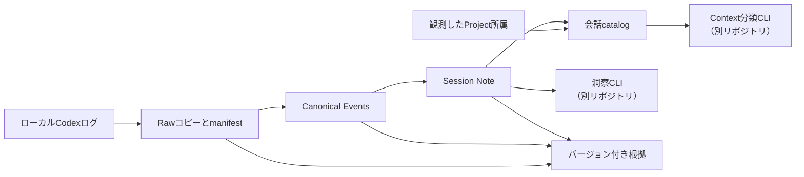
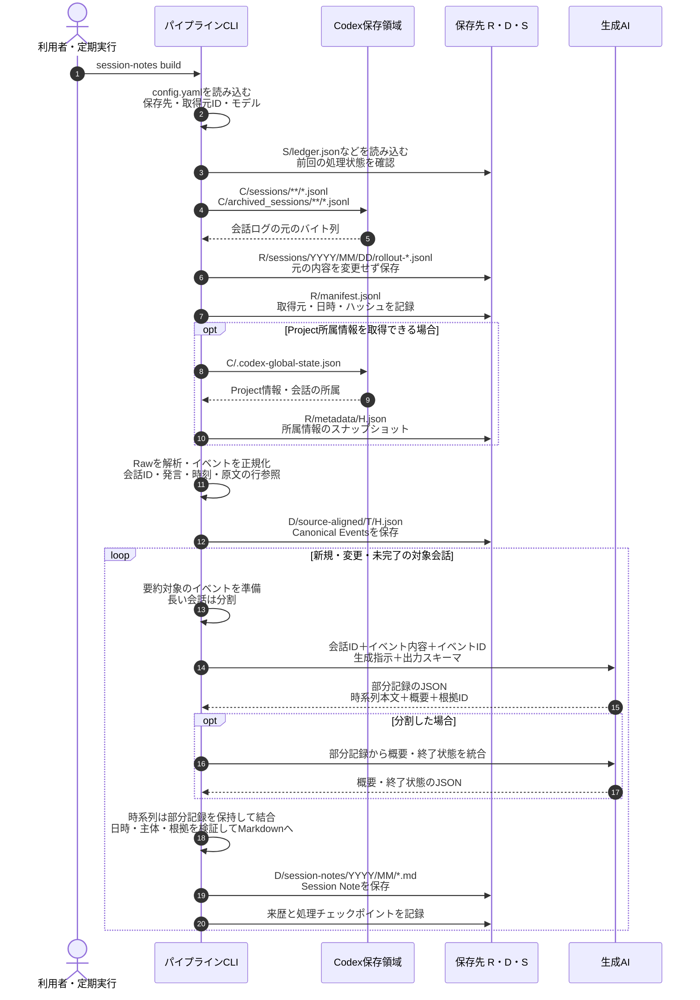

# Tkn Codex Chat Note Pipeline

English: [README.md](README.md)

> 初めて読む場合は、1〜3章（これは何か／セットアップ／実行する）だけで動かせます。
> 4章以降は、必要になったときに引く参照情報です。

## 1. これは何か

Codex CLI がローカルに残す会話ログを保全し、会話スレッド1件につき1枚の Markdown ノート（以後、**Session Note**、または、ノート）を生成するローカル CLI です。

やることは3つです。

1. **保全**：Codex の JSONL ログを、何を手を加えない Raw としてコピーします。
2. **構造化**：Raw を解析し、発言・時刻・原文の行参照を持つ Canonical Events（正規化イベント）にします。
3. **生成**：生成AIに Canonical Events を渡し、Session Note を作ります。

Session Note には、依頼、訂正、失敗した試行、未解決の問い、根拠IDつきの時系列、最後に確認できた状態が残ります。
後から別の観点で会話を考え直すための記録であり、短い要約ではありません。

### 1.1. 生成されるノートの例

Timeline 部分の抜粋です。

```markdown
### 2026-05-17

- **11:27:35 - 11:27:47**
  - Actor: AI
  - Type: Action
  - Text: 公開範囲と一覧取得の可否を調べた。
  - EventRange: L000010 -> L000020
  - Sources: L000010, L000012, L000020
```

各項目は、根拠となる元ログのイベントIDを持ちます。
日時と主体（Actor）は引用されたイベントから機械的に決定されます。AIによる推論生成ではありません。
ノート全体の構成は [Session Noteの内容](docs/reference/session-note-format_ja.md) を参照してください。

### 1.2. 対象範囲

| 項目         | 内容                                                                                                  |
| ------------ | ----------------------------------------------------------------------------------------------------- |
| 会話の取得元 | ローカルの Codex ログのみ                                                                             |
| 推論に使うAI | Codex CLI / Claude Code / GitHub Copilot CLI / Ollama / Azure OpenAI から選択                         |
| 出力         | Session Note（Markdown）、Raw コピー、Canonical Events、来歴（provenance）                            |
| 対象外       | Codex以外のアプリの会話取得、クラウドにのみ存在する履歴、Scope分類・Decision抽出・Working Context生成 |

**会話の取得元は Codex 専用です。**
推論に使うAIはそれとは独立に選べます。Claude Code・Copilot・Ollama は「生成に使うAI」であって、それらの会話を取り込む機能ではありません。

このCLIの処理は Session Note の生成までです。
Session Note分類と Working Context は [tkn_genai_context_curation_pipeline](https://github.com/tuckn/tkn_genai_context_curation_pipeline)、Decision 抽出は [tkn_genai_insight_pipeline](https://github.com/tuckn/tkn_genai_insight_pipeline) の責務としています。
各CLIは単独でインストールでき、バージョンを持つファイルで連携します。

### 1.3. 用語

| 用語                        | 意味                                                                                                           |
| --------------------------- | -------------------------------------------------------------------------------------------------------------- |
| session（セッション）       | 時系列で連続した一連の会話。1 session = 1 Session Note                                                         |
| 会話 / thread               | Codex 側の1会話。`threadKey` で識別する                                                                      |
| Raw                         | 取得元ログのバイト列をそのまま保存したコピー。内容は改変しない                                                 |
| Canonical Events            | Raw を解析した正規化イベント。発言・時刻・原文の行参照を持つ                                                   |
| 取得元 / source             | 読み取り対象のローカル Codex フォルダ。`source_id` で識別する                                                |
| 推論プロバイダー / provider | Session Note 生成に使うAIの実行方式。`codex` `claude-code` `github-copilot` `ollama` `azure-openai` |
| 生成プロファイル / profile  | provider・model・上限などをまとめた設定の名前。`--profile` で切り替える                                      |
| 来歴 / provenance           | 入力の hash・ID・生成条件の記録。出力が何から作られたかを追跡する                                              |
| 生成条件                    | 入力イベント・モデル・プロファイル・prompt・分割条件・上限値の組み合わせ。ここが変わると再生成の対象になる     |
| 途中結果 / cache            | 検証済みの分割要約や統合結果の一時保存。生成条件が同じなら再利用する                                           |
| レビュー済み                | ノートに人手で確認済みの印が付いた状態。上書き保護の対象になる                                                 |

### 1.4. 全体像



### 1.5. データの保存先は4領域に分かれる

| 領域  | 設定キー       | 保存する内容                                        | 失ったときの影響                               |
| ----- | -------------- | --------------------------------------------------- | ---------------------------------------------- |
| Raw   | `raw_root`   | 元ログのコピーと manifest                           | 取得元から元ログが消えると復元できない         |
| data  | `data_root`  | Canonical Events、Session Note、catalog、provenance | 成果物と公開する証跡を失う                     |
| state | `state_root` | 初期化情報、会話ごとの checkpoint、実行レポート     | 再開できず、生成をやり直すことになる           |
| cache | `cache_root` | 生成の途中結果                                      | 再作成できる。ただし再生成の時間と費用はかかる |

`raw_root`・`data_root`・`state_root` は取得元ごとに個別に指定できます。
`cache_root` は全取得元で共通のフォルダで、取得元ごとには設定できません。

## 2. セットアップ

### 2.1. 前提

- Python 3.11 以上
- uv
- 読み取り可能なローカルの Codex JSONL ログ（既定の場所は `~/.codex`）
- 生成に使う推論プロバイダー1つ。既定は Codex CLI

Codex を使う場合は、端末で `codex --version` と `codex login status` が通ることを確認します。
デスクトップアプリの ChatGPT（旧名: Codex App） だけでは CLI の代わりになりません。

### 2.2. インストールと設定ファイルの作成

```console
cd "C:\path\to\tkn_codex_chat_note_pipeline"
uv tool install .
tkn-codex-chat-note --help
tkn-codex-chat-note config init
```

`config init` は `~/.tkn/codex_chat_note_pipeline/config.yaml` を作成し、そのパスを表示します。
編集済みの設定ファイルは保護され、`--force` を付けたときだけバックアップしてから置き換えられます。

### 2.3. 設定ファイルを編集する

表示されたパスの `config.yaml` を開き、取得元と、生成に使うモデルを指定します。
最小構成は次のとおりです。

```yaml
schema_version: "8.1.0"
sources:
  my-windows-pc:
    enabled: true
    source_root: ~/.codex
    include_archived: true
generation:
  session_note_profile: default-jp
  active_profile: codex
  profiles:
    codex:
      provider: codex
      model: <model-name>
      reasoning_effort: high
```

`sources` のキー（この例では `my-windows-pc`）が `source_id` です。保存先フォルダを省略すると `~/.tkn/codex_chat_note_pipeline/<領域>/codex/<source_id>` に保存されます。
指定できる項目は [5. 設定](#configuration)、同梱の記入例は [config.example.yaml](src/tkn_codex_chat_note/resources/config.example.yaml) を参照してください。

```console
tkn-codex-chat-note config show
```

`config show` は、有効な設定値・その値がどの設定層から来たか・解決後の保存先・選択中の要約プロファイルと hash を表示します。
ファイルへの書き込みは行いません。

## 3. 実行する

### 3.1. 最初の1回：clone

```console
tkn-codex-chat-note clone --dry-run
tkn-codex-chat-note clone
```

`--dry-run` は、ローカル入力を読んで実行条件と予定を検証します。
推論もネットワークアクセスも行わず、ディレクトリ・ロック・cache・レポートも作りません。

`clone` は、未作成の管理領域を初期化し、取得できる全履歴を保存・正規化して、対象の Session Note を生成します。
履歴量によっては、**非常に多くの推論時間とトークンを消費します**。

実行が終わると、結果の集計と実行レポートの保存先が標準エラーに表示されます。
まずそのレポートを開いて結果を確認します。
詳細な JSON が必要な場合は `--full-output` を付けます。

### 3.2. 日常の更新：pull

```console
tkn-codex-chat-note pull
tkn-codex-chat-note status
tkn-codex-chat-note provenance validate
```

`pull` は、追加・変更されたログを取り込み、対象ノートを更新し、未完了の生成を再開します。
成功済みで入力条件が変わらないノートについては、モデルを再呼び出ししません。
`--limit 20` のように、1回の実行で生成を試みるノート数を制限できます。
`status` は前回実行時の記録（対象範囲・状態・レポートのパス）を表示し、現在の入力は再走査しません。
`provenance validate` は、保存済みデータの hash・ID・来歴の関係を読み取り専用で検証します。

最後のイベントから `idle_minutes`（既定30分）が経過していない会話は「活動中」とみなし、要約を次回へ延期します。
延期する場合でも、その会話の Raw は先に保存します。

完了判定は Session Note だけで行い、下流CLIが担当する Scope・Decision・Working Context の生成は待ちません。

### 3.3. 中断と再開

`clone` と `pull` は `Ctrl+C` で中断できます。

- 保存済みの Raw と、生成が完了したノートは残ります。
- 検証済みの分割要約と統合結果は cache へ途中保存されます。同じ生成条件で再実行すると保存済みの部分を再利用し、中断時に生成中だった部分からやり直します。
- 生成条件が変わった場合と `--force` を付けた場合は再利用しません。破損した途中結果と、cache を削除した部分は再生成になります。

中断時は `KeyboardInterrupt` が表示され、実行レポートが完了状態にならないことがあります。

### 3.4. Windows タスクスケジューラで週次実行する

初回の `clone` を済ませたあと、普段 CLI にログインしているのと同じ Windows ユーザーで週1回の `pull` を登録します。

| 設定項目     | 値                                                                                          |
| ------------ | ------------------------------------------------------------------------------------------- |
| プログラム   | インストール済み`tkn-codex-chat-note.exe` の絶対パス                                      |
| 引数         | `--config "C:\path\to\config.yaml" pull`                                                  |
| 開始フォルダ | そこに`.tkn/config.yaml` があると設定階層に加わるため、通常実行と同じ設定になる場所にする |

設定オプションは `pull` より前に置きます。
WSL の取得元を有効にしている場合は、そのユーザーから設定した UNC パスを読める必要があります。

`runtime_minutes`（既定230分）は、新しい生成を開始してよい期限です。
期限到達時に実行中だった生成には最大9分の猶予があります。
Raw の取得と正規化はこの期限では中断されません。
タスクスケジューラ側の停止時間は、これらより余裕を持たせてください。

終了コードの読み方は次のとおりです。

| 終了コード | 意味                                                                     | 対応                             |
| ---------- | ------------------------------------------------------------------------ | -------------------------------- |
| `0`      | 成功。`--dry-run` の計画検証が通った場合も `0`                       | なし                             |
| `1`      | 失敗                                                                     | 実行レポートの失敗理由を確認する |
| `2`      | 未完了。`--limit` 指定、活動中の会話の延期、実行時間上限、予算停止など | 次の`pull` で再開する          |

## 4. コマンド一覧

`--config`・`--profile`・`--source` などの共通オプションは、**コマンドの前**に置きます。

| コマンド                              | 動作                                                                               |
| ------------------------------------- | ---------------------------------------------------------------------------------- |
| `config init`                       | 同梱設定を作成する。編集済み設定は保護し、`--force` 時はバックアップ後に置換する |
| `config show`                       | 有効な設定、5段階の設定元、要約プロファイルの hash を表示する                      |
| `clone`                             | 初期化とRawの全保存・ Session Note 生成を行う。再実行で再開できる                 |
| `pull`                              | 初期化済みの保存先へ差分を反映し、不足している Session Note のみ生成する          |
| `raw ingest`                        | Raw 取り込みのみ。Session Note は生成しない                                        |
| `session-notes build`               | Session Note を更新する。`--thread-id` で得意の会話を1件選べる                  |
| `session-notes validate <artifact>` | 既存ノートを読み取り専用で検証する                                                 |
| `status`                            | 前回の対象範囲・状態・レポートのパスを表示する                                     |
| `build-report [--dry-run] [--no-open]` | 保存済み使用量からHTML・JSON・CSVを生成します。通常はHTMLを開きます。 |
| `provenance validate`               | hash・ID・来歴の関係を読み取り専用で検証する                                       |
| `storage migrate`                   | `--from-config` で指定した取得元を新しい保存先へコピーする                       |

生成を伴うコマンドでは、次のオプションを使えます。

| オプション         | 動作                                                                       |
| ------------------ | -------------------------------------------------------------------------- |
| `--dry-run`      | 推論もファイル書き込みもせず、実行条件と予定を検証する                     |
| `--force`        | 入力が同じでも再評価する。レビュー済みファイルの保護は解除しない           |
| `--allow-edited` | 手編集された未レビューのノートの置換を明示的に許可する                     |
| `--limit N`      | 1回の実行で生成を試みるノート数の上限。API呼び出し回数や金額の上限ではない |
| `--full-output`  | 詳細な JSON レポートを標準出力に表示する（既定は集計とレポート保存先のみ） |

`raw ingest` は `--dry-run` と `--full-output` に対応します。

生成・Raw取得コマンドは、進捗と結果の集計、実行レポートの保存先を標準エラーへ表示します。
詳細な JSON を標準出力へ出すのは `--full-output` を付けたときだけです（`config show` などの参照コマンドは従来どおり JSON を標準出力へ出します）。
`-q` は進捗を抑制し、`-v` は診断を追加します。
1件だけを対象にした `session-notes build` でも、実行レポートにはノート全体の処理状況が含まれます。

生成前に、ソースごとに `Session Notes up to date (no regeneration needed): 12/359` と表示します。
これは、保留分も含む対象セッション359件のうち、現在の生成設定で作成済み・再生成不要と確認できたものが12件あるという意味です。
生成に成功するたびに件数が増えます。失敗、dry-runの計画、保護や保留により生成しなかったものは、新たな作成済み件数には加えません。
開始時点の作成済み件数と今回の生成成功件数も別々に表示します。
`Starting thread (attempt 1 this run, limit 3)` は、そのソースで今回生成を試みる1件目を表し、対象全体の通し番号ではありません。
表示される上限はそのソースで使える残り件数です。`--limit` 自体はソース全体で共有します。

<a id="configuration"></a>

## 5. 設定

### 5.1. 設定の優先順位

後のものが前のものを上書きします（以下の数字が大きい設定が優先）。

1. 組み込み既定値
2. ユーザー設定（`~/.tkn/codex_chat_note_pipeline/config.yaml`）
3. 現在のフォルダの `.tkn/config.yaml`
4. `--config` で明示したファイル
5. CLI オプション

各設定ファイルは、統合する前に個別に検証します。
相対パスは、その値を宣言した設定ファイルの場所から解決します。
設定スキーマは `8.1.0` です。キーは snake_case、バージョンは引用符付きの SemVer 文字列で書きます。
未知のキーや、未対応の新しいバージョンはエラーになります。

```console
tkn-codex-chat-note --config "C:\path\to\config.yaml" clone
tkn-codex-chat-note --idle-minutes 0 --runtime-minutes 60 pull --limit 20
```

設定の階層間では、`sources` と `generation.profiles` をマップのキーごとに統合し、同じキーの指定フィールドだけを上書きします。
ある層でマップを明示すると組み込みの既定エントリはそのマップに置き換わるため、独自の `source_id` を追加しても既定の `windows` が余分に有効になることはありません。
`sources: {}` で取得元マップ全体を空にでき、`enabled: false` で継承した取得元を無効にできます（YAML キーの重複は拒否します）。

### 5.2. 取得元（sources）

`sources` は、読み取り対象のローカル Codex フォルダの一覧です。

```yaml
sources:
  my-windows-pc:
    enabled: true
    source_root: ~/.codex
    include_archived: true
  my-wsl-ubuntu:
    enabled: false
    source_root: '//wsl$/Ubuntu/home/<user>/.codex'
    include_archived: true
```

| キー                                          | 既定値       | 意味                                                                                     |
| --------------------------------------------- | ------------ | ---------------------------------------------------------------------------------------- |
| （マップのキー）                              | なし         | `source_id`。値の中に `source_id` を重ねて書かない                                   |
| `enabled`                                   | `true`     | 無効な取得元は走査せず、その入力フォルダは存在しなくてよい                               |
| `source_root`                               | `~/.codex` | `sessions/` ではなく親の `.codex` を指す。sessions・archives・アプリの補助情報を読む |
| `include_archived`                          | `true`     | アーカイブ済みの会話も対象にする                                                         |
| `raw_root` / `data_root` / `state_root` | 省略可       | 最終保存先。省略時は`~/.tkn/codex_chat_note_pipeline/<領域>/codex/<source_id>`         |

`source_id` は、継続して取得する入力フォルダを識別する名前です。
`laptop-windows`、`laptop-wsl-ubuntu` のような、**半角英小文字の kebab-case を推奨**します。
Python の変数名ではなく、設定キー・フォルダ名・来歴の識別子として使われます。

- 使える文字は半角英字（大文字も可）・数字・`.`・`_`・`-` で、先頭は英数字にします。
- 空白、日本語・全角文字、前後の空白、末尾のドットは使えません。
- `CON`・`nul.txt`・`COM1` など Windows の予約名は使えません。
- 大文字・小文字だけが異なる ID も重複として拒否します。自動変換はしません。
- 数字だけの YAML キーは引用符で囲みます。

公開データの識別単位は `(codex, source_id)` です。
下流ツールとの互換性のため、取り込みを開始したあとは変更しないでください。
キーを変更しても、既存データの改名や移行は行われません。
`source_root` や保存先フォルダのパスには、空白や日本語を使えます。
同じ入力フォルダを複数の ID で登録しないでください。

Windows と WSL の入力フォルダには別の ID を付けます。
Windows 側からは、ディストリビューションへアクセスできる状態で上記の UNC パスを利用できます。
WSL 内でこの CLI を実行する場合は、Linux 側のパスと生成用の実行ファイルを設定します（`~` は CLI を実行している OS に従います）。
WSL の例は設定方法を示したもので、実動作確認は未実施です。アカウント別のフィルタは実装していません。

#### 5.2.1. 複数の取得元を使うとき

有効な取得元を、マップに書かれた順に処理します。

- `--limit`（実行全体の生成試行数）と `runtime_minutes`（生成期限）は、全取得元で共有します。
- catalog・provenance・checkpoint・実行レポートは取得元ごとに保持し、書き込み前に全保存領域を検証します。
- ある取得元の失敗は全体の失敗結果に含めますが、他の取得元は続行できます。

```console
tkn-codex-chat-note --source my-windows-pc pull
tkn-codex-chat-note --source my-windows-pc session-notes build --thread-id <thread-id>
```

`--source` はコマンドの前に置き、処理・`status`・`provenance validate`・`storage migrate` の対象を1つ選びます。
省略した場合、処理・`status`・`provenance validate` は有効な全取得元が対象です。
複数が有効な場合、`--thread-id` と `storage migrate` では `--source` で1つ選んでください。
不明な ID や無効な取得元を指定するとエラーになります。
`config show` は常に全取得元の設定と解決済み保存先を表示します。

有効な取得元が1つもない場合は、書き込み前に実行を止めます（`config show` は使用できます）。

### 5.3. Session Note の言語

`generation.session_note_profile` で `default-jp`（日本語・既定）か `default-en`（英語）を選びます。

```yaml
generation:
  session_note_profile: default-jp
```

1回だけ切り替える場合は `tkn-codex-chat-note --session-note-profile default-en pull` のように指定します。

両プロファイルで、スキーマ・見出し・時系列・引用・状態判定は共通です。
切り替わるのは本文の言語と説明文だけで、時刻は `Asia/Tokyo` のままです。
組み込みリソースは `profiles/default-jp/` と `profiles/default-en/` にあり、カスタムのプロファイル名・フォルダ・prompt の指定には対応していません。

言語を変えると次の `build` / `pull` で既存ノートが再生成の対象になり、言語別のノートが併存することはありません（1会話につきノート1枚・ID 1つを維持します）。

<a id="inference-configuration"></a>

### 5.4. 推論プロバイダー（generation.profiles）

`generation.profiles` のキーは任意の設定名です。
どの実行方式を使うかは、各設定の `provider` で明示します。
名前・実行ファイル・URL から実行方式を推測することはありません。

| `provider`       | 接続設定                                                     | 実行方法                                         |
| ------------------ | ------------------------------------------------------------ | ------------------------------------------------ |
| `codex`          | `executable: codex`                                        | 独立した`codex exec`                           |
| `claude-code`    | `executable: claude`                                       | 非対話の Claude Code                             |
| `github-copilot` | `executable: copilot`                                      | 非対話の Copilot CLI                             |
| `ollama`         | `endpoint: http://127.0.0.1:11434`                         | ローカルの chat エンドポイント。ループバックのみ |
| `azure-openai`   | `endpoint: https://<resource>.openai.azure.com/openai/v1/` | v1 Chat Completions                              |

`executable` は CLI の実行ファイル名またはパス、`endpoint` は HTTP の接続先です。
Azure の `authentication`・`pricing`・`limits` は、`model` と同じ階層に置きます。

ローカルモデルを使う例です。

```yaml
generation:
  active_profile: local-gemma
  profiles:
    local-gemma:
      provider: ollama
      model: <installed-local-model>
      reasoning_effort: high
      endpoint: http://127.0.0.1:11434
```

同じ provider で `azure-high`・`azure-low` のように複数の設定を持てます。

```console
tkn-codex-chat-note --profile azure-high pull --dry-run
```

- `--profile` は `generation.active_profile` だけを切り替えます。取得元は変わりません。
- `--model`・`--reasoning-effort` は、選択中のプロファイルをその実行中だけ上書きします。
- `--profile`（生成プロファイル）と `--session-note-profile`（ノート本文の言語）は別の設定です。
- プロファイル名が provider 名と一致していても、名前から実行方式は判断しません。
- 実行レポートと来歴には、provider・model とは別に `generationProfile` を記録します。

CLI 型のプロバイダーでは、選択した生成入力がその CLI の設定先サービスへ送信されます。
会話データに適した送信先かどうかを確認して選んでください（Ollama の接続先はループバックに限定します）。
利用できるモデルと認証は、各サービス側の管理です。

### 5.5. 入力量と費用の制御（Azure OpenAI / Ollama）

Azure OpenAI と、`limits` を設定した Ollama では、送信前の見積もり・実行中の実測・上限到達時の停止を行います。
分割・統合・修正のすべてで、指示文とスキーマを含む入力量を送信前に確認し、分割は枠に収まるまで自動調整します。
修正入力が上限を超える場合、そのリクエストは送信せず、不正な下書きを除いた元の分割・統合入力から再生成します。元の入力はすべて保持し、検証理由は枠に収まれば追加します。必要な場合に短縮・省略するのは検証理由だけです。再生成後も同じ検証を行い、各段階で初回を含め最大3回、コマンド全体の回数・費用上限も維持します。検証済みキャッシュは引き続き再利用できます。
統合の元入力自体が上限を超える場合は、そのSessionの処理を停止し、保存済みの分割を保持します。上限または統合方式を調整してから再開してください。

日本語プロファイルは、自然な日本語で書くようモデルに指示します。ただし、`supplied events` や `actual execution` などの英語表現が含まれることだけを理由に、WARNING・修正API呼び出し・生成失敗にはしません。出力構造、根拠の参照、時系列の網羅性、状態の整合性は引き続き検証します。実際の検証エラーは `generationMetrics.validationFailures` に記録し、修正入力の上限超過から再生成した場合は `repairFallbacks` に回数を残します。
対応端末ではWARNINGを黄色で表示します。リダイレクト時や `NO_COLOR` 指定時は色を付けません。

#### 5.5.1. Azure の設定

```yaml
generation:
  active_profile: azure-high
  profiles:
    azure-high:
      provider: azure-openai
      model: <deployment-name>
      reasoning_effort: high
      endpoint: https://<resource>.openai.azure.com/openai/v1/
      # 以下は任意
      # authentication:
      #   tenant_id: <tenant-guid>
      # pricing:
      #   <deployment-name>:
      #     input_jpy_per_million: 100.0   # 仮の値。確認済みの単価へ置き換える
      #     output_jpy_per_million: 500.0
      #     pricing_date: YYYY-MM-DD
```

`model` には呼び出す **deployment 名**を書きます。
実モデル名と版は API 応答から記録するため、設定に書く必要はありません。
ノートの `generatorModel` は実際に応答したモデル、`generatorDeployment` は要求した deployment です（provenance も両者を分けて記録します）。

`pricing` は、金額を表示したい場合だけ設定します。
一致する単価がなければ token の見積もり・実績だけを表示し、料金は不明、**JPY 上限は適用しない**と表示します（入力・出力・回数の上限は適用します）。
単価は利用者の設定による概算で、Azure の請求情報を自動取得するものではありません。
`--model` などで deployment を変えても、別 deployment の単価は流用しません。

認証に Azure CLI は不要です。
SDK のブラウザ認証と永続 cache を使い、まず保存済みの認証で token を取得し、対話が必要な場合だけブラウザを開きます。

- アカウント記録は `~/.tkn/codex_chat_note_pipeline/authentication/`、token は SDK の暗号化 cache に保存します（平文保存には切り替えません）。
- cache 名はこのアプリ・endpoint・tenant で分離し、他アプリや Azure CLI の認証をコピー・変更しません。
- アカウントを選び直すには、実行を終了してこのアプリの該当アカウント記録だけを削除します。
- `--dry-run` は認証せず、ブラウザも開きません。認証の取消・タイムアウト時は推論を送信する前に停止します（`pull` の履歴取り込みは先に進んでいる場合があります）。

#### 5.5.2. 上限（limits）

`limits` は省略できます。既定値は次のとおりで、すべての deployment の対応能力を表す値ではありません。

| キー                 | 既定値  | 意味                                                      |
| -------------------- | ------- | --------------------------------------------------------- |
| `input_tokens`     | 60,000  | 1回の呼び出しの入力上限                                   |
| `output_tokens`    | 16,000  | 1回の回答の出力上限（推論分を含む）                       |
| `context_tokens`   | 100,000 | context の上限                                            |
| `chunk_characters` | 120,000 | 分割の文字数                                              |
| `max_calls`        | 30      | 1コマンドあたりの呼び出し回数上限                         |
| `max_cost_jpy`     | 100     | 1コマンドあたりの確保額上限（単価設定がある場合のみ適用） |

Ollama では `limits` と、固定した `model_digest` を設定できます。
`context_tokens` と `output_tokens` は `num_ctx` と `num_predict` へ渡します。
tokenizer に依存しない UTF-8 バイト数の上限を使うため、分割数が多くなる場合があります。
`limits` を省略した場合は、上限なしの動作になります。

#### 5.5.3. 事前見積もり（dry-run）

```console
tkn-codex-chat-note pull --dry-run --limit 1
```

- 生成が必要なノートだけを見積もります。最新・レビュー済み・編集保護対象・延期したノートは含めず、検証済みの分割 cache の再利用分も除外します。
- 最終統合の入力量は事前に確定しないため、統合1回分を確保して計算します。
- ファイル作成・認証・通信は行いません。`--full-output` で会話ごとの `generationEstimate` も表示します。
- dry-run はレポートを保存しないため、計画を残す場合は `--full-output` の標準出力をファイルへ保存します。
- Codex などのコマンド方式は、CLI 内部で追加される文脈・スキーマを把握できないため token 数と金額を不明とします。Azure では入力合計 token 見積もり・出力 token 上限・概算費用上限（JPY）まで表示します。
- Azure の token 見積もりは、検証済みのローカル `o200k_base` cache と余裕分で行います。利用できない場合は UTF-8 バイト数の上限を使い、`utf8-byte-upper-bound` と記録します。

#### 5.5.4. 実行中の表示の読み方

実行中は標準エラーに、各呼び出しの入力見積もりと確保額、応答の実 token 数と概算 JPY 費用、会話・全体の集計を表示します。
未知の使用量やローカル実行の費用を 0 として表示することはありません。
12分割の会話を例にすると、次のように読みます。

| 表示                                                            | 読み方                                                                                      |
| --------------------------------------------------------------- | ------------------------------------------------------------------------------------------- |
| `13 base calls`                                               | 分割要約12回＋統合1回                                                                       |
| `output ceiling 208,000 tokens`                               | 13回 × 出力上限16,000 token                                                                |
| `base cost ceiling JPY 53.64 (repairs/retries extra)`         | 基本処理の推定入力と最大出力で計算した上限寄りの概算。内容修正・通信再試行は別枠            |
| `16 model calls, 3 semantic retries, ... estimated JPY 28.69` | 分割12回＋統合1回＋内容修正3回＝16回の送信分。token はAPI応答の実績、円額は設定単価での計算 |
| `command reserve`                                             | 以前のノートや他の取得元も含めた、このコマンド全体の確保額                                  |
| `no request submitted`                                        | その呼び出しは未送信で課金なし（それ以前に送信した分の使用量・費用は残る）                  |

確保額は「推定入力＋最大出力」の費用を積み上げた値で、回答が短くても戻りません。
そのため、実績ベースの概算が100円未満でも、既定の確保額上限100円で停止することがあります。
円額はいずれも Azure の確定請求額ではありません。

実行レポートは `<state_root>/reports/` に run ID 付きで保存され、生成前の見積もり（`generationEstimate`）、呼び出しごとの実使用量・確保額・応答モデル（`generationMetrics.apiRequests[]`、失敗した試行を含む）、会話別と全体の合計（`usageTotals`）を残します。
使用量を取得できない呼び出しがある場合、合計は `null` とし、既知分の小計を別に残します。
失敗後の再開も含めて分析する場合は各 run のレポートを合算してください（`last-run.json` や標準出力の複製も足すと二重計上になります）。

#### 5.5.5. 予算上限に達したときの動作と再開

費用・回数の上限で最初の拒否が起きた時点で、以後の生成を停止し、未完了分を `deferred`（保留）にします。

- 警告は1回だけ表示し、後続の見積もり・生成は行いません。停止は選択した全取得元で共有します。
- 既に最新のノートやレビュー保護は通常どおり維持され、取得元の取り込みと最終レポートの保存は続く場合があります。
- レポートの `generationStop` に理由・確保額・回数・上限を記録します。保留理由は `api-cost-budget` または `api-call-budget`、他に失敗がなければ終了コードは `2` です。
- 予算は1つのコマンドに適用され、別コマンド・別プロセスでは新しい枠になります。Azure 側の費用通知は課金を停止しません。

再開は、同じプロファイル・同じ設定のまま、`--force` を付けずに実行します。

```console
tkn-codex-chat-note --profile azure-high pull --limit 1
```

完了済みで変更のないノートはスキップし、検証済みの分割は再利用します。
新しいコマンドには新しい予算枠が適用されるため、36分割＋統合のような大きな会話も、30回の呼び出し上限の中で複数コマンドに分けて進められます（追加送信には追加費用が発生します）。

必要な1回の呼び出しすら新しい枠に収まらない場合だけ、`limits.max_cost_jpy`・`limits.max_calls` を見直します（費用上限だけ増やしても回数上限は残ります）。
ただし上限値も生成条件の一部のため、変更すると既存の途中結果が再利用対象から外れ、完了済みの未レビューノートも再生成対象になり得ます。
アプリケーションが設定上限を自動で増額することはありません。

#### 5.5.6. 送信内容と再試行

- 入力量を減らすため、本文が一致する重複部分は元イベントへの参照に置き換え、出典IDは短い可逆な別名に変換して送信します。Raw・Canonical Events・全イベントIDは保持し、返答を元のIDへ戻してから検証します。
- 拒否・回答の打ち切り・401/403 は再試行せず失敗にします。429 と一時的なエラーは最大3試行とし、`Retry-After` を尊重します（60秒超の待機指定では、指定時間後の再開を案内して停止）。
- 途中結果には応答モデルの識別子を保存し、後の応答と異なる場合は結果を混ぜずに停止します（`--force` で再生成）。

### 5.6. 設定変更と再生成の関係

| 変更した設定                                                  | 影響                                                                     |
| ------------------------------------------------------------- | ------------------------------------------------------------------------ |
| `session_note_profile`（言語）                              | 既存ノートが再生成対象になる。異なるプロファイルの途中結果は再利用しない |
| `provider` / `model` / `reasoning_effort`               | 生成条件が変わり、再生成対象になる                                       |
| `endpoint` / `deployment` / `limits` / `model_digest` | 生成条件が変わり、以前の途中結果を再利用しない                           |
| プロファイル名だけの変更                                      | 途中結果は無効化しない                                                   |
| `active_profile` の切り替え                                 | 保存先は変わらない                                                       |
| `raw_root` / `data_root` / `state_root`                 | 保存先が変わるだけで、再生成はしない（移行は`storage migrate`）        |

いずれの場合も、レビュー済み・手編集ノートの保護は維持されます。

### 5.7. 使用トークンの記録とHTMLレポート

0.24.0から、Codexの生成でも実使用トークンを保存します。対象はこのCLIの
clone / pull / session-notes build による推論です。要約対象の元チャットの使用量とは別です。

- Codexは codex exec --json の turn.completed.usage を取得します。入力・出力・キャッシュ入力・推論・キャッシュ書込を、提供された範囲で保存します。
- Azure OpenAIと limits を設定したOllamaも同じ使用量履歴に保存します。
- Claude Code、GitHub Copilot、limits 未設定のOllamaは、現時点では試行の日時・結果を保存し、トークン数は不明として記録します。
- 失敗・再試行も対象です。取得できない値は null で、ゼロや推定値に置き換えません。
- Codexは1回のCLI実行内のターン合計、APIはリクエスト単位です。両者の「試行数」は同じ粒度ではありません。
- 入力合計にはキャッシュ入力、出力合計には推論を含みます。これらをさらに足すと二重計上になります。

使用量履歴は <state_root>/usage/<runId>/<usageId>.json に保存します。
呼び出し前に開始状態、終了時に取得済み使用量を保存し、ノート生成の成否も追記します。
強制停止時には開始状態が残ることがあります。応答未取得分の消費量は不明です。
使用量履歴にプロンプト・回答本文・認証情報は保存しません。
既存の実行レポートには generationMetrics.usageRecords と usageTotals も記録します。
API専用の apiRequests は既存の読み取り側向けに維持しますが、同時に合計しないでください。
stateは使用量分析の正本を含むため、削除可能なキャッシュとして扱わずバックアップしてください。

次のコマンドは保存済み履歴だけを読み、生成AI・外部価格取得・元チャットの走査を行いません。

~~~console
tkn-codex-chat-note build-report --dry-run
tkn-codex-chat-note build-report
tkn-codex-chat-note build-report --no-open
~~~

通常実行はHTML・JSON・CSVを更新してHTMLを開きます。--no-open は生成のみ、
--dry-run は検証・集計のみで、保存とブラウザ起動を行いません。
既定では全有効ソースの全履歴を集計します。--source <source_id> をコマンドの前に置くと、
そのソースだけのレポートへ更新します。

既定の保存先は ~/.tkn/codex_chat_note_pipeline/reports で、report_path で変更できます。

| 出力 | 内容 |
| --- | --- |
| index.html | 外部通信なしで開けるHTML。期間・モデル・プロバイダー・コマンド・ソース・生成プロファイル・対象タスクで絞り込み |
| usage.json | 正規化した使用量、元ファイルのSHA-256、集計設定・単価シナリオ、欠測情報 |
| diagnostics.csv | 保存済みの警告・エラー・検証失敗・再試行概要・見送り理由。対象タスクと実行情報を含む |
| usage.csv | 1試行1行の使用量。空欄は不明。表計算ソフト向けに数式となる文字列の先頭を保護 |

HTML内に表示データを埋め込み、HTMLだけでも閲覧できます。JSON・CSVへのリンクを使う場合は
4ファイルを同じフォルダに置いてください。JSON・CSVは画面フィルターを反映しない全件です。
再生成では同名ファイルを置換します。入力の使用量履歴は変更しません。
各ファイルは個別に置換し、HTMLを最後に公開します。書き込み中は外部ツールで読み取らず、
中断した場合は再実行してください。HTMLはその中に埋め込まれた世代のデータで表示されます。

0.25.0以降、推移グラフは「入力・出力」「モデル」「モデル × 入力・出力」を切り替えられます。
凡例ボタンはグラフの系列を表示・非表示にし、ページ上部の条件は各セクションを絞り込みます。
グラフには数値表もあります。対象タスクには現在のノートのFrontmatter titleとファイル名を表示し、
取得できない場合は保存済みのタイトルやタスクIDを使います。title・ファイル名・IDで検索できます。
data_root内の参照先から長さを制限したFrontmatterだけを読み、ノート本文は取り込みません。
移動・削除・不正なFrontmatterがあってもレポートを生成します。titleは現在のノートの名前であり、
過去の内容を再現するものではありません。検証用ハッシュは根拠ファイル全体とFrontmatter部分
（区切り行を除き、改行をLFに揃えたUTF-8文字列）を区別します。

警告・エラーには保存済みのメッセージ、工程、対象タスク・実行ID、最終的なノート結果を表示します。
使用量がない実行も含み、重要度・分類・内容で絞り込めます。予算・時間上限や保護による見送りはINFO、
明示的な予算停止はWARNINGです。検証のWARNINGは修復成功後にも残ります。
実行全体の診断に表示するモデルはその実行で観測されたモデルで、原因の特定ではありません。
モデルを記録していない診断はunknownです。端末だけのWARNINGや未保存の失敗理由は復元できません。
件数は診断記録の数であり、失敗したタスク数ではありません。

使用量上位10件のランキング、工程別使用量、モデル別の修復トークン・割合、タスクの生成成功回数から、
費用がかかる処理や繰り返し生成を確認できます。修復使用量はrepair / regenerate工程で、通信再試行とは
区別します。これらは見直す対象を探す指標であり、品質スコアや同条件のモデル比較ではありません。
要約品質は対象ノートと元の会話を確認して判断してください。

日・週・月は生成の実行開始日で集計し、既定はUTCです。日本時間には540分を設定します。
旧実行レポートのAPI使用量も取り込み、履歴との重複を除きます。
旧Codexは --ephemeral 実行だったため、記録されていない過去使用量を復元できません。
「取得済み合計」「不明件数」「未完了」を区別し、欠測を含む平均は下限参考値として表示します。

参考料金は usage_report.price_scenarios に設定します。推論時の予算設定とは独立しており、
料金シナリオを変えてもノート生成や再課金は発生しません。下記は架空の単価です。

~~~yaml
schema_version: "8.1.0"
report_path: ~/.tkn/codex_chat_note_pipeline/reports
usage_report:
  utc_offset_minutes: 540
  price_scenarios:
    comparison-model:
      currency: USD
      pricing_date: "2026-09-19"
      input_per_million: 1.0
      output_per_million: 5.0
      cache_policy: no-cache
~~~

no-cache は全入力を通常入力単価で試算します。observed は実測キャッシュ内訳を使い、
cached_input_per_million を必須とします。cache_write_per_million も指定した場合は
書込数が判明している試行だけ計算します。内訳不明はゼロと推定せず算出不可にします。

費用は「同じトークン数を使った場合」の参考値です。別モデルでは分割方式・推論量・回答長が
変わるため、切り替え後の費用の予測ではありません。サブスクリプションの実請求額、
ツール料金・税・為替換算も含みません。キャッシュ読込・書込が通常入力と別料金の場合、
その内訳を入力合計から引いて各単価を適用します。推論を出力合計へ再加算しません。
単価未設定ならトークン量のみ確認できます。外部価格を自動取得する処理はありません。

## 6. 保存構造

省略時の保存先は「領域の役割 → 取得元アプリ → 取得環境 → データの種類」の順です。
`raw_root` などを明示した場合は、その直下からデータの種類を配置します。

以下の表で、`P` は取得プロバイダー（`codex` 固定）、`I` は `source_id`、`T` は `threadKey`、`H` は内容 hash を表します。

| 保存パス                                                                          | 内容                                                       |
| --------------------------------------------------------------------------------- | ---------------------------------------------------------- |
| `<raw_root>/sessions/...`                                                       | Codex 元ログの相対構造とバイト列を保持した最新コピー       |
| `<raw_root>/archived_sessions/...`                                              | Codex 側のアーカイブ構造を保持した最新コピー               |
| `<raw_root>/manifest.jsonl`                                                     | 取得元・参照・hash を記録する Raw manifest                 |
| `<raw_root>/metadata/H.json`                                                    | 観測したアプリの Project 情報                              |
| `<data_root>/source-aligned/T/H.json`                                           | 元ログの参照位置を持つ Canonical Events                    |
| `<data_root>/session-notes/YYYY/MM/...md`                                       | 会話開始年月で分けた現在の Session Note                    |
| `<data_root>/catalog/threads.json`                                              | この取得元の会話・所属・状態・ノート参照をまとめた catalog |
| `<data_root>/provenance/...`                                                    | この取得元の不変 snapshot・entity・activity・公開 index    |
| `<state_root>/pipeline.json`                                                    | 取得元ごとの初期化情報・storage バージョン                 |
| `<state_root>/threads/T/...`                                                    | 会話単位の内部 checkpoint                                  |
| `<state_root>/ledger.json`・`reports/`・`last-run.json`・`normalization/` | 取得元ごとの実行・正規化状態                               |
| `<cache_root>/P/I/...`                                                          | 取得元ごとの再利用可能な生成作業 cache                     |

例えば `source_id` が `my-windows-pc` で保存先を省略した場合、Raw は `~/.tkn/codex_chat_note_pipeline/raw/codex/my-windows-pc/sessions/...`、ノートは `~/.tkn/codex_chat_note_pipeline/data/codex/my-windows-pc/session-notes/YYYY/MM/...md` になります。
パス中の `codex` という区分は、互換性のため維持します。
各取得元の最終保存先は `config show` の `storage.sourceRoots.<source_id>` で確認できます。

保存先を決めるときの注意です。

- 各 root は互いに分離し、取得元の `source_root` や設定ファイルとも重ならない場所にします。
- 共通の親の下に `raw/`・`data/`・`state/` を並べると、まとめてバックアップ・移動できます。
- state は再開・checkpoint のための永続データなので、data とセットで管理します。
- 公開する証跡は data 内の provenance に保持します。
- cache は再作成できるため、移行時にはコピーしません。

各 root には取得元 ID を含む所有権 marker とロックを置き、異なる取得元への流用を拒否します。
同じ会話の `threadKey` が別の環境にもあっても、ノートID・checkpoint・catalog・provenance は取得元ごとに独立します。
出力ファイル内の参照（`data:/`・`raw:/codex/<source_id>/`）の解決方法は [出力データと他CLIとの連携仕様](docs/reference/data-contract.md) を参照してください。

<a id="processing-flow"></a>

### 6.1. session-notes build の処理

`session-notes build` は、会話ログを Raw として保存・正規化し、対象会話の Session Note を Markdown で生成します。
`--thread-id` で会話を1件選べます。
Decision と Working Context は、このコマンドでは生成しません。
AI には、イベント内容・イベントID・生成指示・出力スキーマを渡します。

次の図の略記は、この表のとおりです。

| 図中の表記 | 設定項目                            | 既定の保存先                                                |
| ---------- | ----------------------------------- | ----------------------------------------------------------- |
| `C`      | `sources.<source_id>.source_root` | `~/.codex`                                                |
| `R`      | `sources.<source_id>.raw_root`    | `~/.tkn/codex_chat_note_pipeline/raw/codex/<source_id>`   |
| `D`      | `sources.<source_id>.data_root`   | `~/.tkn/codex_chat_note_pipeline/data/codex/<source_id>`  |
| `S`      | `sources.<source_id>.state_root`  | `~/.tkn/codex_chat_note_pipeline/state/codex/<source_id>` |

`T` は会話の `threadKey`、`H` は内容の hash です。



保存する Canonical Events と、要約処理が使うイベントは同じ解析結果に基づきます（保存した JSON を再読込せず、メモリー上のイベントを渡します）。
この段階の要約単位は会話であり、作業 scope による統合とは独立しています。

### 6.2. 保存先を別のフォルダへ移す

現行形式の保存領域を別フォルダへ移す場合は `storage migrate` を使います。
Raw・Session Note・正規化データ・来歴・再開状態をコピーし、ノートの ID・内容・レビュー状態を保持します。
推論は行わないため、保存先の変更だけでは再生成されません。

1. 移動元の最終保存先と取得元 ID を単独で解決できる設定ファイルを用意します。`--from-config` の設定には、他の設定階層の値は統合されません。
2. 同じ取得元 ID を持つ設定を別ファイルに用意し、`raw_root`・`data_root`・`state_root` を移動元と重ならない新しい最終保存先にします。複数の取得元が有効なら `--source` で1つ選びます。
3. コピー中は移動元への書き込みを停止し、次の順に確認・実行します。

```console
tkn-codex-chat-note --config "C:\path\to\destination.yaml" config show
tkn-codex-chat-note --config "C:\path\to\destination.yaml" --source my-windows-pc storage migrate --from-config "C:\path\to\source.yaml" --dry-run
tkn-codex-chat-note --config "C:\path\to\destination.yaml" --source my-windows-pc storage migrate --from-config "C:\path\to\source.yaml"
tkn-codex-chat-note --config "C:\path\to\destination.yaml" --source my-windows-pc provenance validate
```

移動元のデータと設定は変更・削除しません。cache はコピーせず、移動先で再作成されます。
コピー先で競合があれば停止し、中断後は同じ設定で再開できます（完了済みの再実行では書き込みません）。
移動後の通常実行には移動先の設定を使い、下流CLIの `notes_roots` は入力名を保ってパスを更新してください。
コピー時の保証は [出力データと他CLIとの連携仕様](docs/reference/data-contract.md#storage-layout-5) を参照してください。

### 6.3. 既存データを引き継がずに作り直す

新しい設定ファイルを作り、空の `raw_root`・`data_root`・`state_root` を指定して、[3. 実行する](#3-実行する) の手順を行います。

```console
tkn-codex-chat-note --config "C:\path\to\rebuild.yaml" config init
```

作成した設定を編集し、その後の `config show`・`clone` にも同じ `--config` を指定します。
再構築できる範囲は、取得元に残っている会話ログだけです。
別の保存領域に作り直すため、旧ノートの ID・手編集・レビュー状態は引き継ぎません。
なお `--config` を指定しても下位の設定層の検証は省略されないため、読み込まれるユーザー設定や `.tkn/config.yaml` も有効なスキーマである必要があります。

## 7. 対応範囲と制限

### 7.1. 取得対象

- ローカルの `sessions` と、既定では `archived_sessions` を対象にします。
- Project 未所属・対応先不明・所属が曖昧な会話も対象です。アプリの Project 情報がなくても会話を保存できます。
- クラウドだけにある ChatGPT / Work の履歴は取得しません。
- 内部処理や承認レビューの会話、通常のユーザー発言を持たないログは、保存・正規化はしますが要約からは除外します。
- 旧形式のログも対象にし、イベント日時がない場合はノート上で「時刻不明」と表示します。
- `inter_agent_communication_metadata`（`trigger_turn` など）は既知の制御情報として Raw に保持し、要約の根拠には含めません。
- 未対応のレコードや不正な JSONL は実行レポートに残します。Unicode の区切り文字を JSONL の改行と誤認することはありません。

### 7.2. 画像と長文

埋め込み画像の本体は Raw と正規化データに保持します。
テキスト推論には base64 の符号列を渡さず、画像の形式・バイト数・ハッシュを示し、視覚的内容が未確認であることをノートに明記します。
通常の長文は保持し、入力サイズに応じて分割します。

### 7.3. 同じ会話に複数ファイルがある場合

完全一致とバイト列の追記関係は、重複としてまとめます。
それ以外は各履歴・分岐を保持し、1つの Session Note 内で History ID ごとに時系列と出典を表示します（採用された分岐や、別履歴による取り消しは推定しません）。
全ファイルを Raw に保存し、正規化・ノート生成の来歴にも各入力を残します。`history_base` は取得元のメタデータとして記録します。
分岐が変わった場合は同じノートIDを維持して再生成し、変更のない `pull` では再生成しません。

### 7.4. 生成結果の性質

- Session Note は派生した記録であり、元の根拠を置き換えるものではありません。
- 各分割の未解決・未確認事項は、同じ履歴の後続イベントが解決を示さない限り最終ノートに残します。最新の依頼が完了しても、以前の未確認事項が自動的に空になることはありません。
- 未解決・未確認事項は、内部の `pendingStateItems` に種類・配列内の位置・項目ごとの根拠IDを持ちます。最終状態全体の根拠を各項目へ使い回しません。項目の根拠が欠ける、重複する、存在しない記録を指す場合は修正対象です。
- 統合では各項目を残すか解消するかを先に出力し、その後に最終状態を生成します。解消には関係する各履歴で後続の根拠が必要で、その根拠も最終状態の参照に残します。未解決の依頼を残して `done` にすることはできませんが、未検証事項だけなら `done` と両立できます。矛盾は修正対象とし、依頼を黙って消したり状態を推測で置き換えたりしません。
- 実行レポートの `generationMetrics.stateItems` に項目の本文と根拠を、統合成功時の `stateItemReviews` に判定を残します。内部の項目別根拠は生成キャッシュに保存し、公開するSession Noteのスキーマは変えません。生成仕様の更新により次回buildでは旧仕様の生成結果・キャッシュが再生成対象になりますが、レビュー済み・手編集済みノートの保護は維持します。独立したAPI呼び出し段階は追加しませんが、根拠情報の分だけ生成データ量は増えます。
- 出典が本当に解決を示すかはモデルの判断によるため、事実確認が不要になるわけではありません。
- Project への所属が変わっても、会話のIDは変わりません。所属の観測はこのCLIに残し、意味に基づく Scope や承認済みの関連は下流CLIで扱います。

### 7.5. 実行環境

Windows でファイルの置換が一時的に拒否された場合は、元のファイルを保ったまま短時間再試行します。
恒常的なエラーは実行レポートに失敗として残します。

最低対応は Python 3.11 ですが、記録済みの実行環境は Windows / Python 3.12.10 です。
他の Python バージョンや、WSL を含む非 Windows 環境での実行は未検証です。

## 8. 更新後の再インストール

コードやリソースを更新したあとは再インストールします。

```console
cd "C:\path\to\tkn_codex_chat_note_pipeline"
uv tool install . --reinstall
```

## 9. 開発と検証

```console
uv sync --locked
uv run python -m pytest
uv run python -m ruff check .
uv run python -m mypy src
uv build
```

自動テストは匿名の会話データと推論の代替実装を使い、設定・保存・再開・編集保護・生成結果の検証を確認します。
実サービスの認証や、実モデルによる要約品質を保証するものではありません。
一時データには、テストフレームワークまたは OS の一時フォルダを使います。

配布物を変更したときは、一時的な環境へビルドした wheel をインストールし、チェックアウト外から `--version`・`--help`・`config init`・`config show` と同梱の言語プロファイルを確認します。
連携仕様を変更したときは、匿名の出力を使い、下流CLIで ID・hash・入力参照を検証してください。

実データの保存領域と分けてノートの品質を比較する場合は、`scripts/evaluate_session_notes.py` を評価専用のディレクトリに対して実行します（`--manifest` / `--config` / `--output` / `--thread` を指定。`--dry-run` は計画の検証のみ）。

## 10. 関連ドキュメント

| 文書                                                                                                                   | 読む目的                                                                 |
| ---------------------------------------------------------------------------------------------------------------------- | ------------------------------------------------------------------------ |
| [出力データと他CLIとの連携仕様](docs/reference/data-contract.md)                                                             | 出力を読み取るツールの実装。ID・schema・hash・来歴・整合性確認の取り決め |
| [Session Noteの内容](docs/reference/session-note-format_ja.md)                                                                    | 生成ノートの構成と各項目の意味                                           |
| [Azure構造化出力](https://learn.microsoft.com/en-us/azure/foundry/openai/how-to/structured-outputs)                     | Azure 送信時の構造化出力の仕様                                           |
| [ブラウザ認証](https://learn.microsoft.com/en-us/python/api/azure-identity/azure.identity.interactivebrowsercredential) | Azure の対話認証の仕様                                                   |
| [Ollama chat API](https://docs.ollama.com/api/chat)                                                                     | Ollama 接続先の仕様                                                      |
